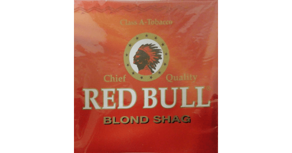
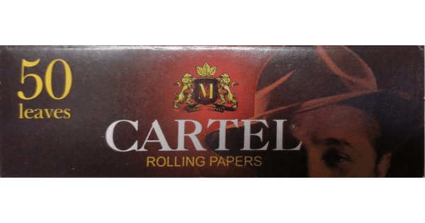
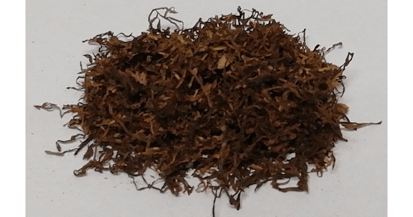

+++
image = "d3de71ebd8576f3c29a5b737a1c010c1.png"
title = "シャグレビュー: RED BULL BLONDE"
publishDate = "2020-05-20T02:16:00+09:00"
lastmod = "2020-05-20T02:16:00+09:00"
tags = [ "Review", "Shag", "Tabaco" ]
googleAds = false
+++

## 1. 製品概要

|||
|---|---|
| 商品名 | RED BULL BLONDE |
| 原産国 | ドイツ |
| 内容量 | 40g |
| 販売価格 | 約 1,100 円 |
| グラム単価 | 約 27.5 円/g |

　RED BULL BLONDE は，ドイツが原産国のシャグです。ヴァージニアブレンドであり，RED BULL シリーズのスタンダードポジションといえるシャグです。グラム単価が 27.5 円/g なので，チェ・シャグシリーズと比べると少しだけ高めです。

## 2. 付属品

|||
|---|---|
| 商品名 | CARTEL |
| 種類 | フリーバーニング |
| 枚数 | 50 枚 |

　付属品の CARTEL は，フリーバーニングタイプのローリングペーパーです。その他のローリングペーパーと比較すると厚めのローリングペーパーです。製品によっては，RED BULL のオリジナルローリングペーパーが付属する場合もあるそうです。

## 3. シャグ

　開封直後は，ヴァージニアブレンド特有の自然な香りが楽しめます。シャグ自体は，その他のシャグに比べて乾燥している印象です。そのため，開封後は加湿作業を行ったほうが良いと思います。付属品の CARTEL + フィルター無しで吸ったところ，しっかりとしたタバコ本来の味が楽しめました。

## 4. 感想

　シャグ自体は，王道のヴァージニアブレンドという印象を受けました。マールボロ (赤) やラッキーストライクを愛煙している人は，好きなシャグだと思います。しかし，上記でも述べましたが乾燥が目立つため加湿作業推奨です。また，ヴァージニアブレンド特有のタバコらしさを味わうには，付属品のようなフリーバーニングタイプのローリングペーパーではなく，スローバーニングタイプのローリングペーパーの方が相性が良いと思います。RED BULL シリーズは他にも多くの種類があるため，それらのシャグにもチャレンジしたいと思います。