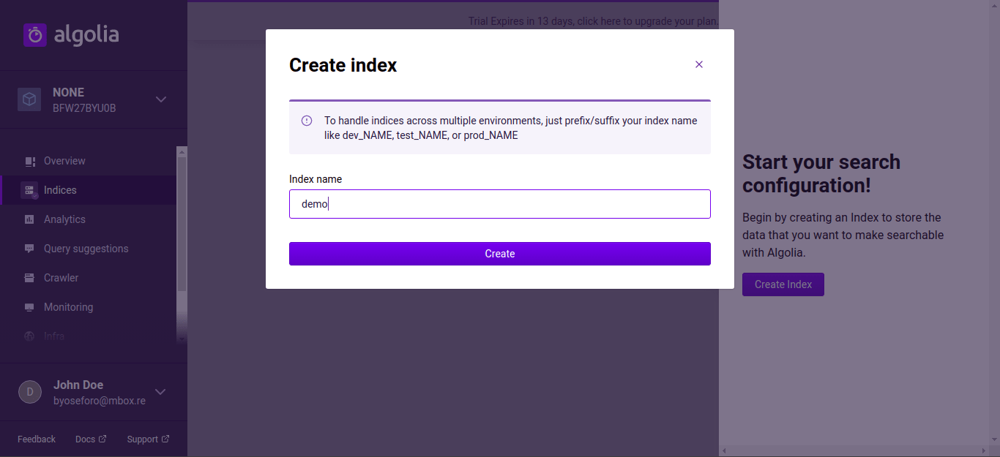
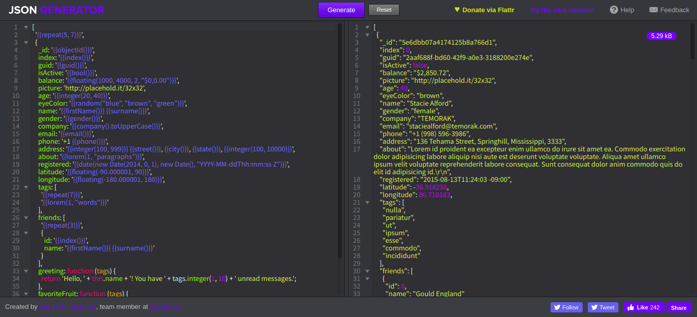
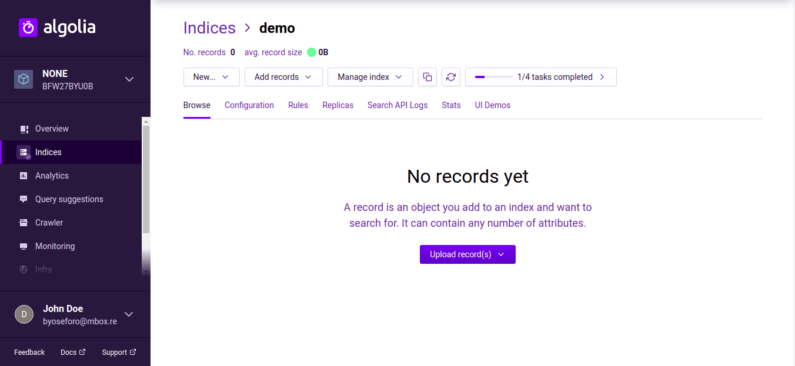
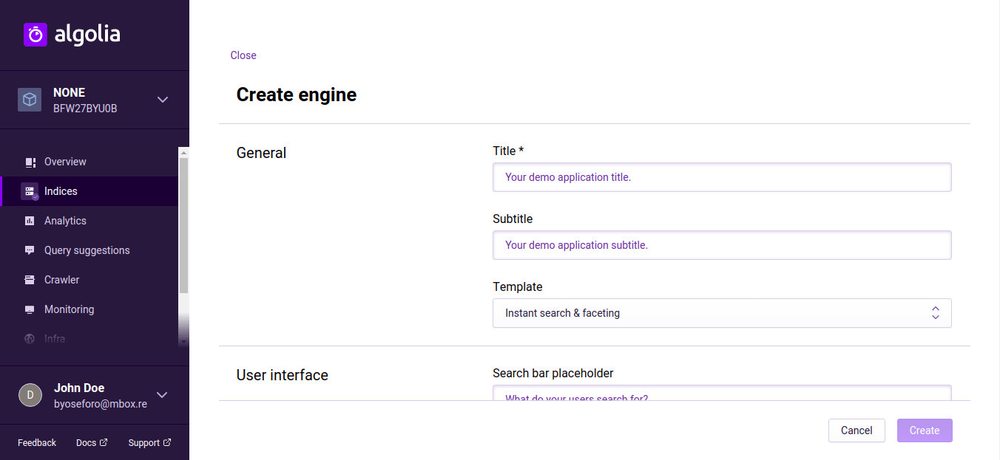
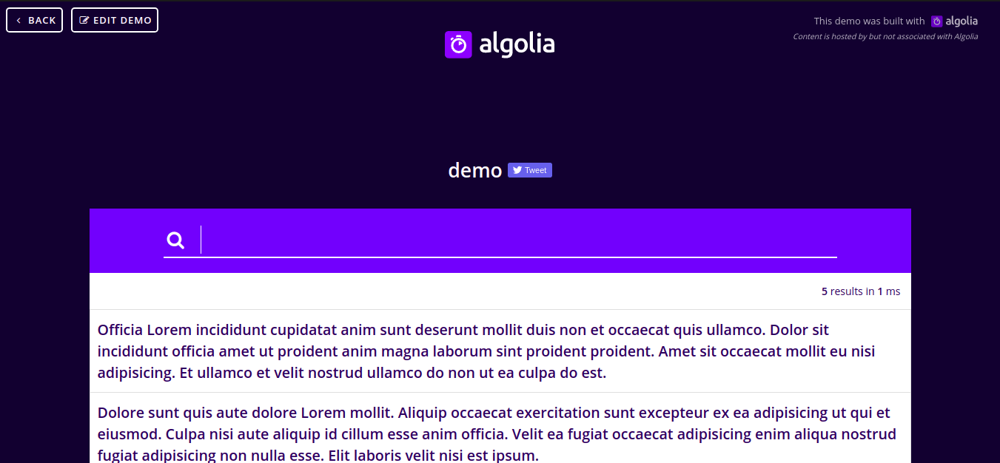

+++
slug = "tips-build-ui-demo-env-algolia"
image = "0a3107b790102ed856accbbb843fa5d4.png"
title = "Algolia が提供している動作検証機能の『UI Demos』を構築する"
publishDate = "2020-03-15T14:58:00+09:00"
lastmod = "2020-09-21T01:11:00+09:00"
tags = [ "Tips", "Algolia" ]
googleAds = true
aliases = ["786da85d3e7603308b182cc8fed19214"]
+++

## 1. はじめに

　[Algolia](https://www.algolia.com/) は，検索エンジンを SaaS モデルで提供しているサービスであり，データの管理や検索アルゴリズムの設定を Web 上で行うことが可能です。また，管理しているデータの確認や設定した検索アルゴリズムの動作検証を行うために『UI Demos』が提供されています。本記事では，『UI Demos』を構築する手順としてサンプルデータの作成方法と『UI Demos』の設定方法について記述します。

## 2. Index の作成

　Algolia にアクセスすると Index の作成を求められるので，指示に従って Index を作成します。本記事では，*demo* という名前で作成します。

## 3. JSON の作成・転送

　サンプルデータが手元に存在する場合は，そのサンプルデータを用いてデモサイトを作成します。しかし，サンプルデータが手元に存在しない場合は，サンプルデータジェネレーターなどを用いてサンプルデータを作成します。本記事では，[JSON Generator](https://www.json-generator.com/) を利用してサンプルデータを作成します。

　サンプルデータを JSON ファイルとしてローカルに保存します。Algolia のトップページから「Indices」→「demo」→「Upload record(s)」→「Upload file」を選択し，ローカルに保存した JSON ファイルを Algolia に転送します。

## 4. UI Demos の作成

　サンプルデータの転送が完了したら，「UI Demos」→「Generate a UI demo」を選択します。*title* は適当な名前を入力し，*Primary attribute* は *about* を設定します。

　設定が完了したら *Create* をクリックして UI Demo を作成します。UI Demo の作成が完了したら，show ボタン (目のアイコン) をクリックして UI Demo にアクセスします。以下のような画面にアクセスできたら UI Demo が正常に作成されています。検索バーに文字を入力して，検索エンジンが正常に動作しているか確かめて下さい。

　*Primary attribute* と *Secondary attribute*，*Tertiary attribute* に入力した変数名が，検索対象になります。また，*Image attribute* に画像の URL を入力すると UI Demo にサムネイルが表示され，*URL attribute* に URL を入力を入力すると UI Demo にリンクが付与されます。最後に，作成された UI Demo は，オープンアクセスの状態になっているので，セキュリティが気になる人は *Username* と *Password* を入力することでアクセス制限をかけることができます。

## 5. おわりに

　ここまで，『UI Demos』を構築する手順としてサンプルデータの作成方法と『UI Demos』の設定方法について記述してきました。高機能な検索エンジンが手軽に使えるのは魅力的です。色々な場面で活用することができそうです。