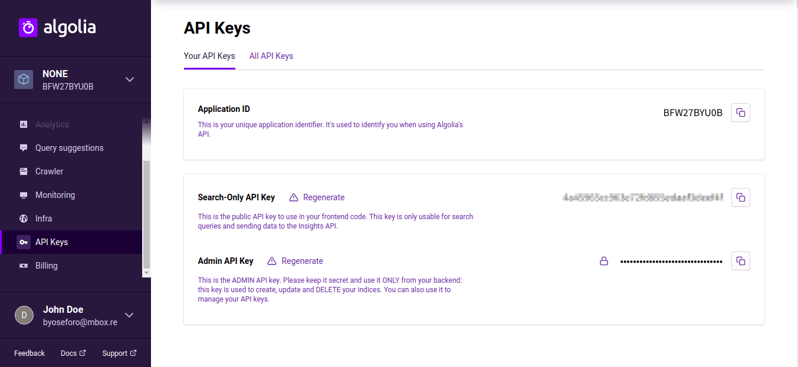

+++
slug = "tips-get-algolia-index-python"
image = "0a3107b790102ed856accbbb843fa5d4.png"
title = "Python 3 を用いて Algolia の Index を取得する"
publishDate = "2020-03-15T17:35:00+09:00"
lastmod = "2020-03-15T17:35:00+09:00"
tags = [ "Tips", "Algolia", "Python" ]
googleAds = true
aliases = ["e9f13a57370909374d7d35a5a1244f0d"]
+++

## 1. はじめに

　Algolia では，豊富な API が公開されています。また，公開されている API を操作する各種言語のライブラリも公開されています。本記事では，Python を用いて Algolia の Index を取得する方法について記述します。

## 2. 前提条件

　これ以降は，以下の条件が整っている前提で記述します。

* Algolia のアカウント登録済み
* Algolia に Index を作成済み
* Python3 がインストール済み
* pip3 がインストール済み

## 3. 事前準備

　Algolia のデータを取得するには，*Application ID* と *Admin API Key* が必要になります。取得するには，Algolia のトッページから「API Keys」にアクセスすると表示されます。



## 4. 実装・実行

　Algolia の[クイックスタート](https://www.algolia.com/doc/guides/getting-started/quick-start/tutorials/quick-start-with-the-api-client/python/?language=python)によると，[algoliasearch](https://pypi.org/project/algoliasearch/) をインストールする必要があるので pip3 を用いてパッケージをインストールします。

```bash
$ pip3 install --upgrade 'algoliasearch>=2.0,<3.0'
```

　[ドキュメント](https://www.algolia.com/doc/guides/sending-and-managing-data/manage-your-indices/how-to/exporting-index-data-to-a-file/#exporting-the-index)を参考に，スクリプトを作成します。*[APPLICATION_ID]* と *[ADMIN_API_KEY]* には，上記で取得した Application ID と Admin API Key に置換します。*[YOUR_INDEX_NAME]* には，取得したい Index の名前に置換します。

```python
#!/usr/bin/env python3

import json
from algoliasearch.search_client import SearchClient

client = SearchClient.create('[APPLICATION_ID]', '[ADMIN_API_KEY]')
index = client.init_index('[YOUR_INDEX_NAME]')

res = index.browse_objects()
print( json.dumps(obj=list(res), ensure_ascii=False, indent=2) )
```

　上記のスクリプトを実行し，JSON データが表示されれば正常に動作しています。また，標準出力をファイルに設定することで JSON ファイルとしてエクスポートすることもできます。

## 5. おわりに

　ここまで，Python を用いて Algolia の Index を取得する方法について記述してきました。Python 以外にも，Java や Golang，Scala なども同様の操作ができます。

## 環境情報

* pip Ver.9.0.1
* Python Ver.3.6.9
* Zorin OS 15.2 Core (Ubuntu 18.04 LTS)