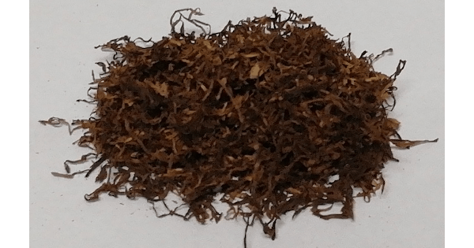

+++
slug = "review-shag-red-bull-blonde"
image = "efad0ad5ad5683d66fb4401b18219ba8.png"
title = "シャグレビュー: RED BULL BLONDE"
publishDate = "2020-05-20T02:16:00+0900"
lastmod = "2020-12-09T11:35:24+0900"
tags = ["Review", "Shag", "Tabaco"]
aliases = ["1e9fc312aaf654ccc13e8781ba445124", "shag-review-red-bull-blonde"]
+++

## 1. 商品概要

| 項目 | 内容 |
|---|---|
| 商品名 | RED BULL BLONDE |
| 原産国 | ドイツ |
| 内容量 | 40g |
| 販売価格 | 約 1,130 円 |
| グラム単価 | 約 28.25 円/g |

　[RED BULL BLONDE](https://rpx.a8.net/svt/ejp?a8mat=3BDYDP+AUKDMA+2HOM+BWGDT&rakuten=y&a8ejpredirect=https%3A%2F%2Fhb.afl.rakuten.co.jp%2Fhgc%2Fg00pq7a4.2bo11488.g00pq7a4.2bo12d31%2Fa20052522171_3BDYDP_AUKDMA_2HOM_BWGDT%3Fpc%3Dhttps%253A%252F%252Fitem.rakuten.co.jp%252Fplaza%252Fstd-3931%252F%26m%3Dhttp%253A%252F%252Fm.rakuten.co.jp%252Fplaza%252Fi%252F10013374%252F) は，ドイツが原産国のシャグであり，[RED BULL VIRGINIA](https://rpx.a8.net/svt/ejp?a8mat=3BDYDP+AUKDMA+2HOM+BWGDT&rakuten=y&a8ejpredirect=https%3A%2F%2Fhb.afl.rakuten.co.jp%2Fhgc%2Fg00pq7a4.2bo11488.g00pq7a4.2bo12d31%2Fa20052522171_3BDYDP_AUKDMA_2HOM_BWGDT%3Fpc%3Dhttps%253A%252F%252Fitem.rakuten.co.jp%252Fplaza%252Fstd-3934%252F%26m%3Dhttp%253A%252F%252Fm.rakuten.co.jp%252Fplaza%252Fi%252F10013384%252F) をベースに，よりマイルドに仕上がっています。内容量が 40g で約 1,130 円のため，グラム単価が約 28.25 円/g です。che や COLTS シリーズと比較するとグラム単価が少し高いです。また，ローリングペーパーとして CARTEL が付属しています。CARTEL は，フリーバーニングタイプのローリングペーパーで，50 枚入りです。商品によっては，RED BULL のオリジナルローリングペーパーが付属する場合もあるそうです。

## 2. 初期状態

　開封直後は，タバコの葉っぱ特有の良い香りが立ち込めました。葉っぱの状態は，開封直後にしては相当乾燥している状態でした。また，刻み具合も粗めのカッティングが施されているようです。そのため，開封直後の状態では巻くのが難しいので，加湿作業を行ったほうが良いと思います。

<!-- 付属品の CARTEL + フィルター無しで吸ったところ，しっかりとしたタバコ本来の味が楽しめました。 -->

## 3. 喫煙感想

　まずは，Smoking の No.8 Brown + フィルター無しで喫煙しました。商品概要に記載されている通り，かなりマイルドに仕上がっており，フィルター無しでも吸えます。味わいとしては，市販の紙タバコだとマールボロ (赤) やラッキーストライク，シャグだと [REDFIELD NATURAL](https://rpx.a8.net/svt/ejp?a8mat=3BDYDP+AUKDMA+2HOM+BWGDT&rakuten=y&a8ejpredirect=https%3A%2F%2Fhb.afl.rakuten.co.jp%2Fhgc%2Fg00pq7a4.2bo11488.g00pq7a4.2bo12d31%2Fa20052522171_3BDYDP_AUKDMA_2HOM_BWGDT%3Fpc%3Dhttps%253A%252F%252Fitem.rakuten.co.jp%252Fplaza%252F10018439%252F%26m%3Dhttp%253A%252F%252Fm.rakuten.co.jp%252Fplaza%252Fi%252F10018439%252F) に近いような印象です。

　次に，Smoking の No.8 Brown + ZIG-ZAG REGULAR FILTERS で喫煙しました。フィルターを付けた状態だと，RED BULL BLONDE の香りがフィルタリングされてしまい，煙感のみが残ってしまう印象です。

## 4. 総合評価

　che や COLTS シリーズと比較するとグラム単価が少し高く，開封直後でも乾燥しており巻きづらい。更に，フィルターを通すと香りがフィルタリングされてしまうなど，残念ながら RED BULL BLONDE をあえて選ぶ特徴を見つけることは出来ませんでした。