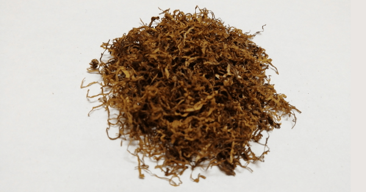

+++
slug = "review-shag-ark-royal-paradise-tea"
image = "d3247769054b2c460d488bf0fe2b0c46.png"
title = "シャグレビュー: ARK ROYAL PARADISE TEA"
publishDate = "2020-12-11T17:43:30+0900"
lastmod = "2020-12-11T17:43:30+0900"
tags = ["Review", "Shag", "Tabaco"]
weight = 0
+++

## 1. 商品概要

| 項目 | 内容 |
|---|---|
| 商品名 | ARK ROYAL PARADISE TEA |
| 原産国 | ウルグアイ |
| 内容量 | 30g |
| 販売価格 | 約 800 円 |
| グラム単価 | 約 26.7 円/g |

　[ARK ROYAL PARADISE TEA](https://rpx.a8.net/svt/ejp?a8mat=3BDYDP+AUKDMA+2HOM+BWGDT&rakuten=y&a8ejpredirect=https%3A%2F%2Fhb.afl.rakuten.co.jp%2Fhgc%2Fg00pq7a4.2bo11488.g00pq7a4.2bo12d31%2Fa20052522171_3BDYDP_AUKDMA_2HOM_BWGDT%3Fpc%3Dhttps%253A%252F%252Fitem.rakuten.co.jp%252Fplaza%252F10015713%252F%26m%3Dhttp%253A%252F%252Fm.rakuten.co.jp%252Fplaza%252Fi%252F10015713%252F) は，紅茶の香りが着香されたフレーバー系のシャグです。内容量が 30g で約 800 円，グラム単価が約 26.7 円/g であり，一般的な価格帯のシャグになります。また，ローリングペーパーとして漂白 + スローバーニングの LIBELLA EXTRA THIN が付属しています。

## 2. 初期状態

　開封直後は，紅茶の優しい香りが立ち込めます。適度が湿度が保たれているため，加湿作業も必要ないと思います。また，葉脈や茎などの混入も少ないため，除去作業も必要ないと思います。

## 3. 喫煙感想

　まずは，Smoking Brown Thinnest + フィルター無しの状態で喫煙しました。フレーバー系のシャグは，葉っぱの香りと燃焼時の香りが異なることが多いですが，ARK ROYAL PARADISE TEA は，ほぼ変わらない香りで楽しむことが出来ました。しかし，フィルター無しの状態では煙感に紅茶の香料が負けてしまっている印象です。

　次に，Smoking Brown Thinnest + ZIG-ZAG REGULAR FILTERS で喫煙しました。フレーバー系のシャグは，フィルターを通すことで香りが飛んでしまう場合があるのですが，ARK ROYAL PARADISE TEA は，しっかりと紅茶の香りを感じることが出来ました。フィルターが余計な煙感を抑えてくれたことによって，フィルター無しの状態より，強く紅茶の香りを楽しむことが出来ました。

## 4. 総合評価

　フレーバー系の紙煙草やシャグを多く試してきましたが，どれも香りが強すぎたり燃焼時の香りが異なるため，なかなか自分に合うものが見つかりませんでした。しかし，ARK ROYAL PARADISE TEA は非常にバランスが良く，初めてのフレーバー系のシャグとしてもオススメです。