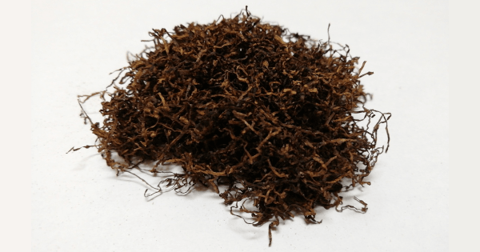

+++
slug = "review-shag-che-blue"
image = "62ddbf8c2b70747eed25ede4afff6708.png"
title = "シャグレビュー: che Blue"
publishDate = "2020-12-12T12:08:30+0900"
lastmod = "2020-12-12T12:08:30+0900"
tags = ["Review", "Shag", "Tabaco"]
weight = 0
+++

## 1. 商品概要

| 項目 | 内容 |
|---|---|
| 商品名 | che Blue |
| 原産国 | ルクセンブルク |
| 内容量 | 25g |
| 販売価格 | 約 640 円 |
| グラム単価 | 約 25.6 円/g |

　[che Blue](https://rpx.a8.net/svt/ejp?a8mat=3BDYDP+AUKDMA+2HOM+BWGDT&rakuten=y&a8ejpredirect=https%3A%2F%2Fhb.afl.rakuten.co.jp%2Fhgc%2Fg00pq7a4.2bo11488.g00pq7a4.2bo12d31%2Fa20052522171_3BDYDP_AUKDMA_2HOM_BWGDT%3Fpc%3Dhttps%253A%252F%252Fitem.rakuten.co.jp%252Fplaza%252F10014746-114%252F%26m%3Dhttp%253A%252F%252Fm.rakuten.co.jp%252Fplaza%252Fi%252F10017625%252F) は，ルクセンブルクで生産されているハーフスワレ系のシャグです。内容量が 25g で，販売価格が約 640 円。よって，グラム単価が約 25.6 円/g になります。その他のシャグと比較すると，グラム単価が約 10 円ほど安いです。また，ローリングペーパーとして漂白 + スローバーニングのオリジナルローリングペーパーが付属しています。

## 2. 初期状態

　開封直後は，ハーフスワレ系特有の鰹節のような香りが立ち込めます。シャグの状態は，湿度も適切に保たれており，目立った葉脈や茎などの混入も少ないです。そのため，加湿作業や除去作業も必要ないと思います。

## 3. 喫煙感想

　まずは，Smoking Brown Thinnest + フィルター無しの状態で喫煙しました。ハーフスワレ系のシャグ特有の強いコクと香りをダイレクトで楽しむことが出来ます。しかし，煙感が非常に強いので，中盤から終盤は口の中がピリピリとしてきました。

　次に，Smoking Brown Thinnest + ZIG-ZAG REGULAR FILTERS で喫煙しました。同じ条件の [DRUM](https://rpx.a8.net/svt/ejp?a8mat=3BDYDP+AUKDMA+2HOM+BWGDT&rakuten=y&a8ejpredirect=https%3A%2F%2Fhb.afl.rakuten.co.jp%2Fhgc%2Fg00pq7a4.2bo11488.g00pq7a4.2bo12d31%2Fa20052522171_3BDYDP_AUKDMA_2HOM_BWGDT%3Fpc%3Dhttps%253A%252F%252Fitem.rakuten.co.jp%252Fplaza%252F10014953%252F%26m%3Dhttp%253A%252F%252Fm.rakuten.co.jp%252Fplaza%252Fi%252F10014953%252F) と比較すると若干，che Blue の方が煙感が強い印象です。しかし，吸い比べしないとわからないレベルなので，両者に大きな差は無いと思います。

## 4. 総合評価

　同じく有名なハーフスワレ系のシャグでる DRUM と比較すると，味や香りに大きな差は無いにもかかわらず，グラム単位が約 10 円安く，コストパフォーマンスに優れています。また，内容量が 25g と手が出しやすいのも特徴です。そのため，ハーフスワレ系の入門として非常にオススメです。