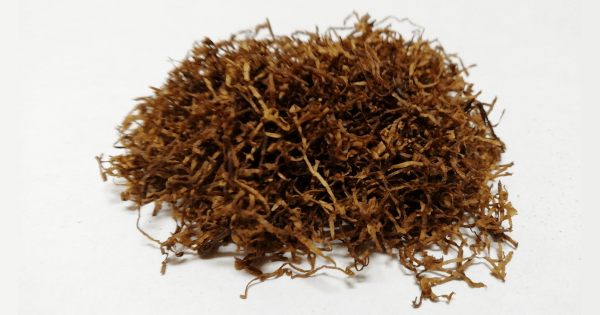

+++
slug = "review-shag-jbr-blueberry-mint"
image = "283c7dd03bcccfc1819819d4424056bd.png"
title = "シャグレビュー: JBR BLUEBERRY MINT"
publishDate = "2020-12-12T13:43:02+0900"
lastmod = "2020-12-12T13:43:02+0900"
tags = ["Review", "Shag", "Tabaco"]
+++

## 1. 商品概要

| 項目 | 内容 |
|---|---|
| 商品名 | JBR BLUEBERRY MINT |
| 原産国 | ドイツ |
| 内容量 | 30g |
| 販売価格 | 約 780 円 |
| グラム単価 | 約 26 円/g |

　[JBR BLUEBERRY MINT](https://rpx.a8.net/svt/ejp?a8mat=3BDYDP+AUKDMA+2HOM+BWGDT&rakuten=y&a8ejpredirect=https%3A%2F%2Fhb.afl.rakuten.co.jp%2Fhgc%2Fg00pq7a4.2bo11488.g00pq7a4.2bo12d31%2Fa20052522171_3BDYDP_AUKDMA_2HOM_BWGDT%3Fpc%3Dhttps%253A%252F%252Fitem.rakuten.co.jp%252Fplaza%252F10018397%252F%26m%3Dhttp%253A%252F%252Fm.rakuten.co.jp%252Fplaza%252Fi%252F10018397%252F) は，ブルーベリーとミントの香りが着香されたフレーバー系のシャグです。内容量が 30g で，販売価格が約 780 円。よって，グラム単価が約 26 円/g となっており，一般的な価格帯のシャグになります。また，ローリングペーパーとして無漂白 + スローバーニングの PUEBLO Organic Hemp が付属しています。

## 2. 初期状態

　開封直後は，ブルーベリーとミントの香りではなく，紫蘇の葉っぱのような独特な香りが立ち込めます。シャグの状態は，湿度も適切に保たれており，目立った葉脈や茎などの混入も少ないです。そのため，加湿作業や除去作業も必要ないと思います。

## 3. 喫煙感想

　まずは，Smoking Brown Thinnest + フィルター無しの状態で喫煙しました。燃焼時は，開封直後に感じた紫蘇の葉っぱのような独特な香りからラベンダーのような香りに変わりました。しかし，どちらにしても「ブルーベリーとミントの香りか？」と問われると，答えは「No」です。

　次に，Smoking Brown Thinnest + ZIG-ZAG REGULAR FILTERS で喫煙しました。フィルター無しの状態と同じく，ラベンダーのような香りが漂います。ARK ROYAL シリーズのような優しい香りではなく，CHOICE シリーズのような強い香りです。

## 4. 総合評価

　もの凄く人を選びそうなシャグというのが第一印象です。少なくとも，ブルーベリーとミントのシャグとして購入するのはオススメ出来ません。また，単体で吸うよりもブレンドでアクセント用に使う方が良い気がします。価格帯もミドルレベルなので，初めてフレーバー系の購入を検討されている人は ARK ROYAL シリーズをオススメします。