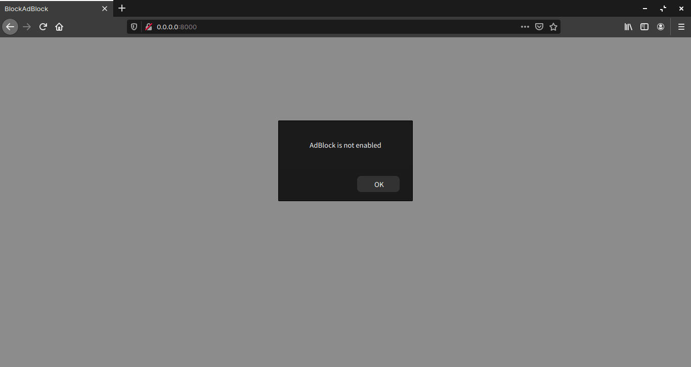

+++
image = "87723fff3efdb01577cd12d8b5501cfe-min.png"
title = "JavaScript 製の広告ブロック検知ライブラリ BlockAdBlock の使い方"
publishDate = "2020-03-08T22:31:00+09:00"
lastmod = "2020-03-12T06:46:00+09:00"
tags = [ "JavaScript", "Library", "Web" ]
googleAds = true
+++

## 1. はじめに

　[Adblock Plus](https://chrome.google.com/webstore/detail/adblock-plus-free-ad-bloc/cfhdojbkjhnklbpkdaibdccddilifddb?hl=ja) に代表される広告ブロックによって，ユーザーは広告を非表示にすることができるようになりました。しかし，広告ブロックをよく思わない人たちによって広告ブロックを検知する手法が提案されています。本記事では，JavaScript 製の広告ブロック検知ライブラリ [BlockAdBlock](https://github.com/sitexw/BlockAdBlock) の使い方について記述します。

## 2. 最小構成

　最小構成は非常にシンプルです。[blockadblock.js](https://github.com/sitexw/BlockAdBlock/blob/master/blockadblock.js) と以下の index.html を同一ディレクトリ上に配置します。

```html
<!DOCTYPE html>
<html lang="en">

<head>
  <meta charset="UTF-8">
  <meta name="viewport" content="width=device-width, initial-scale=1.0">
  <title>BlockAdBlock</title>
</head>

<body>
  <script src="./blockadblock.js"></script>
  <script>
    function adBlockNotDetected() {
      alert('AdBlock is not enabled');
    }
    function adBlockDetected() {
      alert('AdBlock is enabled');
    }
    if (typeof blockAdBlock === 'undefined') {
      adBlockDetected();
    } else {
      blockAdBlock.onDetected(adBlockDetected).onNotDetected(adBlockNotDetected);
    }
  </script>
</body>

</html>
```

　*注意* ローカルの index.html をブラウザで開くだけでは正常に動作しません。そこで，[Netlify](https://www.netlify.com/) などのホスティングサービスにアップロードして動作確認する必要があります。本記事では，Python 3 の [http.server](https://docs.python.org/ja/3.7/library/http.server.html) を用いて動作確認します。

```bash
$ tree
.
├── blockadblock.js
└── index.html

0 directories, 2 files
$ python3 -m http.server 8000
Serving HTTP on 0.0.0.0 port 8000 (http://0.0.0.0:8000/) ...
```

　Python 3 が出力したアドレスに任意のブラウザでアクセスします。広告ブロックの有無によってアラートの内容が変化すれば正常に動作しています。



## 3. オプション

　blockAdBlock.setOption() メソッドを用いることでオプションを変更することができます。

```js
// (1)
blockAdBlock.setOption('checkOnLoad', false);
// (2)
blockAdBlock.setOption({
	debug: true,
	checkOnLoad: false,
	resetOnEnd: false
});
// (1) と (2) のどちらでも記述可能
```

　以下のオプションが設定可能です。オプションの詳細は [README.md](https://github.com/sitexw/BlockAdBlock/blob/master/README.md) を参照してください。

```js
checkOnLoad: true
resetOnEnd: true
loopCheckTime: 50
loopMaxNumber: 5
baitClass: 'pub_300x250 pub_300x250m pub_728x90 text-ad textAd text_ad text_ads text-ads text-ad-links'
baitStyle: 'width: 1px !important; height: 1px !important; position: absolute !important; left: -10000px !important; top: -1000px !important;'
debug: false
```

## 4. メソッド

　上記で使用した blockAdBlock.setOption() メソッドや blockAdBlock.onDetected() メソッド，blockAdBlock.onNotDetected() メソッドの他に以下のメソッドが提供されています。メソッドの詳細は [README.md](https://github.com/sitexw/BlockAdBlock/blob/master/README.md) を参照してください。

```js
blockAdBlock.setOption(options, value);
blockAdBlock.check(loop);
blockAdBlock.emitEvent(detected);
blockAdBlock.clearEvent();
blockAdBlock.on(detected, fn);
blockAdBlock.onDetected(fn);
blockAdBlock.onNotDetected(fn);
```

## 5. おわりに

　ここまで，JavaScript 製の広告ブロック検知ライブラリ BlockAdBlock の使い方について記述してきました。広告ブロックと広告ブロック検知はイタチごっこ状態なので，本記事で紹介した手法も対策される可能性はあります。そのため，BlockAdBlock の使用は自己責任でお願いします。