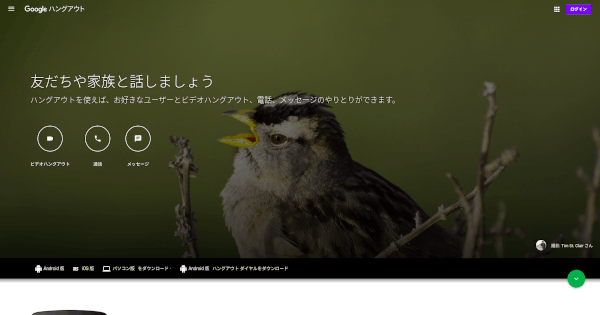
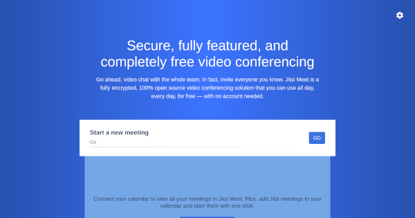
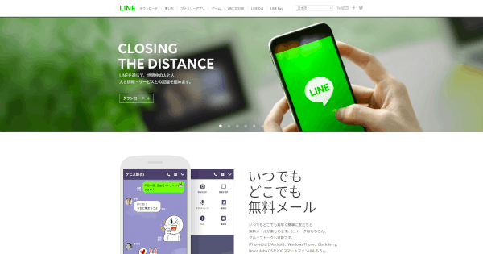
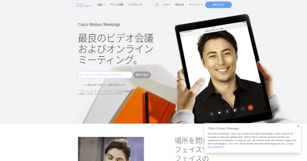
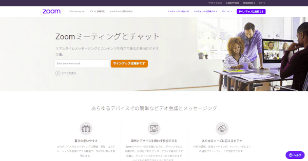

+++
image = "e2cc79f2d57954c319ee9ef1e5e8b373.png"
title = "オンライン飲み会に使用したビデオ通話ツールのレビュー"
date = "2020-04-20T17:03:00+09:00"
lastmod = "2020-05-10T16:19:00+09:00"
tags = [ "GUI", "Web" ]
googleAds = true
+++

## 1. はじめに

　COVID-19 の影響によってリモートによる作業が増えてきました。それに伴って飲み会もビデオ通話ツールを活用したオンラインに移行しています。本記事では，筆者がオンライン飲み会で使用したビデオ通話ツールについて記述します。

## 2. Google ハングアウト

　[Google ハングアウト](https://hangouts.google.com/) は，Google が提供している統合メッセージングサービスです。無料で時間無制限かつ高音質・高画質なビデオ通話が可能です。また，クロスプラットフォーム対応に対応しているのでブラウザやモバイルアプリから通話することができます。ホスト以外の人も Google アカウントを所持している必要がありますが，ほとんど人は Google アカウントを所持しているので問題ないと思います。しかし，2020 年に Google ハングアウトを分割する[発表](https://9to5google.com/2018/12/02/google-hangouts-shutting-down/)がなされているため，今後も同様の条件でビデオ通話ができるかは不明です。

　⭕ 時間無制限  
　⭕ 音質・画質は安定  
　⭕ クロスプラットフォーム対応  
　❌ ゲスト参加不可  

## 3. Jitsi

　[Jitsi](https://jitsi.org/) は，FLOSS で開発されているビデオカンファレンスツール群です。無料で公開されている[Jitsi Meet](https://meet.jit.si/) を用いることによって，時間無制限かつ高音質・高画質なビデオ通話が可能です。また，クロスプラットフォーム対応に対応しているため，デスクトップ OS やモバイルアプリからビデオ通話が可能です。更に，クライアントツールやバックエンドエンジンも Apache License 2.0 で公開されているため，プライベート環境下で使用することも可能です。欠点らしい欠点が現状では見つかりません。強いて上げるならば，Jitsi Meet の URL を短くすると知らない人が入る可能性が上がる点です。

　⭕ 時間無制限  
　⭕ 音質・画質は安定  
　⭕ クロスプラットフォーム対応  
　⭕ ゲスト参加不可  

## 4. LINE

　[LINE](http://line.me/) は，LINE 株式会社が提供するコミュニケーションサービスです。無料で時間無制限のビデオ通話が可能です。また，クロスプラットフォーム対応に対応しているため，デスクトップ OS やモバイルアプリからビデオ通話が可能です。しかし，Linux 版のクライアントツールが公式から提供されておらず，Google Chrome 版の拡張機能もビデオ通話に対応していないため，Linux からはビデオ通話することができません。また，音質・画質共に安定しているとは言えず，ビデオ通話に LINE アカウントが必須なのもマイナスポイントです。

　⭕ 時間無制限  
　🔼 クロスプラットフォーム対応 (Linux は制限有り)  
　❌ 音質・画質は不安定  
　❌ ゲスト参加不可  

## 5. Webex

　[Webex](https://www.webex.com/ja/video-conferencing.html) は，Cisco が提供しているビデオ会議アプリケーションです。無料で高音質・高画質なビデオ通話が可能です。また，クロスプラットフォーム対応に対応しているのでブラウザやモバイルアプリから通話することができます。ホスト以外の人は，アカウントが必要ないため (メールアドレスは必須) スムーズに導入することができます。無料プランでは，時間制限がありますが 12 時間は連続通話が可能なため，あまり気にならない制限ではあります。

　⭕ クロスプラットフォーム対応  
　⭕ ゲスト参加可能  
　⭕ 音質・画質は安定  
　🔼 時間制限有り (無料プランは 12 時間)  

## 6. Zoom

　[Zoom](https://zoom.us/jp-jp/meetings.html) は，Zoom Video Communications が提供している Web 会議サービスです。無料で高音質・高画質なビデオ通話が可能です。また，クロスプラットフォーム対応に対応しているのでブラウザやモバイルアプリから通話することができます。ホスト以外の人は，アカウントが必要ないためスムーズに導入することができます。しかし，無料プランでは 40 分で通話が切れてしまうためストレスに感じました。また，セキュリティ問題が発覚するなど，不安に感じる箇所も多々あります。

　⭕ クロスプラットフォーム対応  
　⭕ ゲスト参加可能  
　⭕ 音質・画質は安定  
　❌ 時間制限有り (無料プランは 40 分)  

## 7. おわりに

　ここまで，筆者がオンライン飲み会で使用したビデオ通話ツールについて記述してきました。個人的には，Jitsi が最有力サービスだと思います。オンライン飲み会は長時間の通話が可能なため，くれぐれも飲み過ぎには注意しましょう。