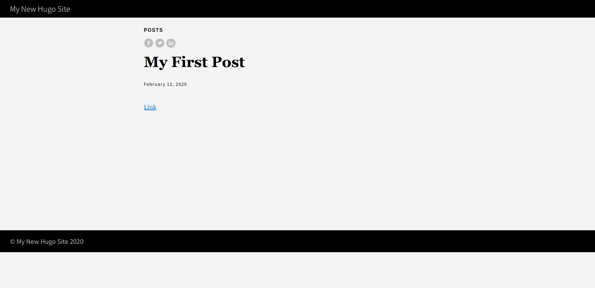
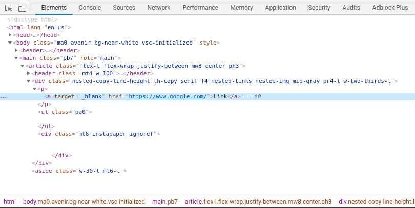
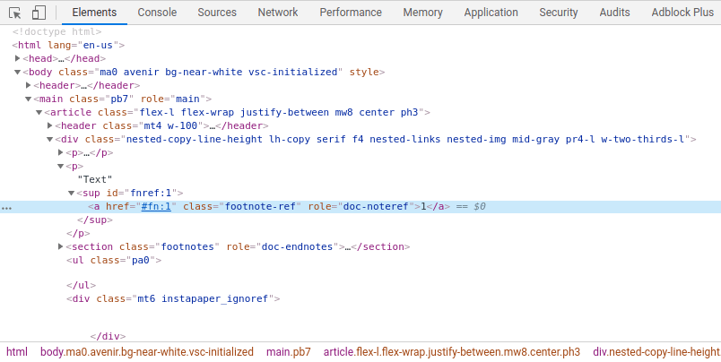

+++
image = ""
title = "Hugo の replaceRE を用いて Markdown のリンクを外部リンク化する"
publishDate = "2020-02-12T17:24:00+09:00"
lastmod = "2020-04-07T02:05:00+09:00"
tags = []
googleAds = true
draft = true
+++

## 1. はじめに

　本記事で紹介する手法を用いることで Markdown のリンクを外部リンク化することができます。しかし，現在は Hugo Ver.0.62.0 から追加された [Markdown Render Hooks](https://gohugo.io/getting-started/configuration-markup#markdown-render-hooks) を用いることが推奨されています。そのため，本記事で紹介する手法は非推奨になります。

## 2. 環境構築

　[クイックスタート](https://gohugo.io/getting-started/quick-start/)の Step 1 〜 Step 5 に従って実験用の環境を構築します。Step 1 〜 Step 5 までが完了した後，クイックスタートの Step 4 で作成した *my-first-post.md* にリンクを追記します。

```md
---
title: "My First Post"
date: 2019-03-26T08:47:11+01:00
draft: true
---
[Link](https://www.google.com/)
```

　任意のブラウザを用いて *http://localhost:1313/posts/my-first-post/* にアクセスし，以下のような画面が表示されれば実験用の環境構築は完了です。



## 3. 実装

　Hugo には，正規表現を用いて置換する [replaceRE](https://gohugo.io/functions/replacere/) が実装されています。この replaceRE を用いて *\<a\>* に *target="_blank"* を追加することで，Markdown のリンクを外部リンク化します。*_default* フォルダに格納されている *single.html* の 49 行目に replaceRE を追記します。

```HTML
{{- .Content -}}
　↓
{{ .Content | replaceRE "<a" "<a target=\"_blank\"" | safeHTML }}
```

　Chrome Developer Tools で *\<a\>* を参照すると *target="_blank"* が追記されているいることが確認できます。



## 4. 問題

　上記で作成した *my-first-post.md* に注釈を追記すると，注釈の *\<a\>* にも *target="_blank"* が追記されてしまいます。

```md
---
title: "My First Post"
date: 2019-03-26T08:47:11+01:00
draft: true
---
[Link](https://www.google.com/)

Text[^1]

[^1]: Annotation
```


## 5. 修正

　上記の状態では，ユーザビリティが著しく下がってしまいます。そこで，正規表現を用いて *href* の先頭に *#* が付いている *\<a\>* は置換対象外にします。これによって，注釈の *\<a\>* に *target="_blank"* が追記されることを防ぎます。

```HTML
{{ .Content | replaceRE "<a" "<a target=\"_blank\"" | safeHTML }}
　↓
 {{ .Content | replaceRE "<a href=\"[^#]" "<a target=\"_blank\" href=\"h" | safeHTML }}
```



## 6. おわりに

　ここまで，Hugo に実装されている replaceRE を用いて Markdown のリンクを外部リンク化する手法について記述してきました。本記事で紹介した手法は，ソースコードを 1 行書き換えるだけで実装できます。しかし，*rel="noopener"* を任意のポイントに追記できないため，現在では非推奨な手法です。Hugo Ver.0.62.0 以前を使用しなくてはいけない場合以外は，[Markdown Render Hooks](https://gohugo.io/getting-started/configuration-markup#markdown-render-hooks) を用いるようにしましょう。

## 環境情報

* Hugo Ver.0.62.2
* Google Chrome Ver.79.0.3945.130
* Zorin OS 15 Core (Ubuntu 18.04 LTS)