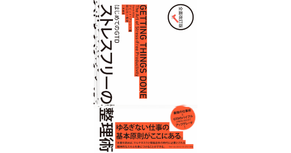
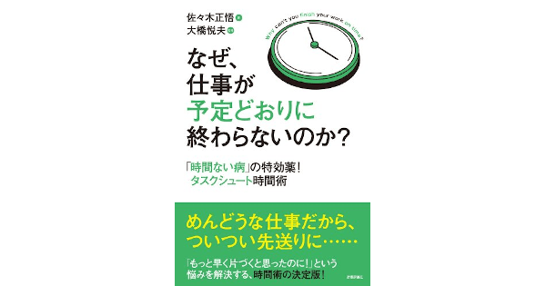
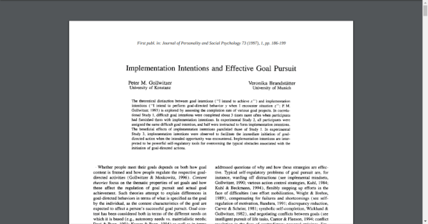
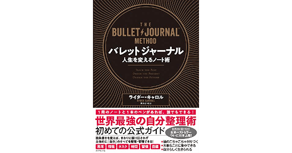
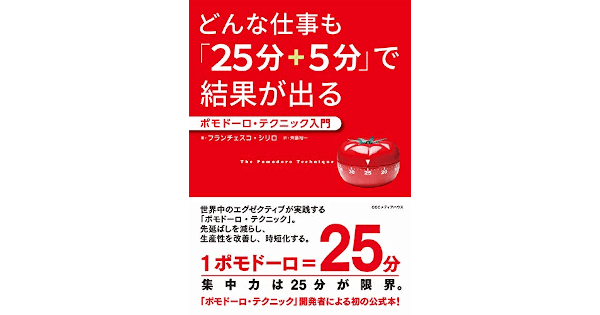
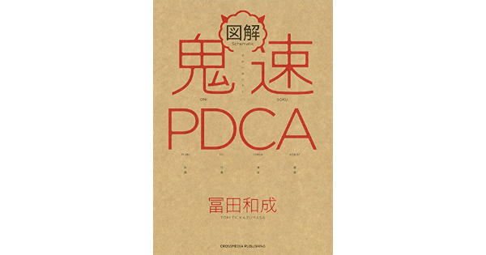

+++
image = "217e41d2922c45e3c8c23dcc4462878d.png"
title = "時間に追われる現代人に送るライフハックメソッド 6 選"
publishDate = "2019-07-06T00:00:00+09:00"
lastmod = "2020-05-28T09:58:00+09:00"
tags = ["LifeHack", "GTD", "PDCA"]
googleAds = true
+++

## 1. はじめに

　世間では働き方改革の影響もあり，単位時間辺りの生産性が重視されつつあります。それに伴い，タスク管理や時間管理などのライフハックに関する書籍やネット記事などが多く出回るようになりました。しかし，これらは玉石混交であり，悪質なものは数百ページに渡って根性論じみた文章が綴られている場合もあります。反対に良質なものはシステマティックに設計されており，生産性を上げるだけでなくストレス軽減などの恩恵を受けることができます。本記事では，筆者が厳選したライフハックメソッドについて記述します。

## 2. Getting Things Done

　Getting Things Done (以降，GTD と略す) は，David Allen 氏によって考案された生産性向上手法です。その特徴として，5 ステップ (Capture・Clarify・Organize・Reflect・Engage) と[ワークフロー](https://gettingthingsdone.com/pdfs/tt_workflow_chart.pdf)を用いて思考を整理することで，生産性を向上させる点が挙げられます。しかし，GTD は非常に奥が深く，学習コストが大きいです。そのため，継続的な訓練が必要になります。更に詳しい情報は，[公式サイト](https://gettingthingsdone.com/)の[日本語版](http://gtd-japan.jp/about)や David Allen 氏が執筆した書籍の[和訳版](https://amzn.to/3frSwBL)などを参照してください。

## 3. TaskChute

　TaskChute は，大橋悦夫氏によって考案されたタスク管理手法です。また，同氏によって開発されたタスク管理ツールの名称を指す場合もあります。その特徴として，[マニャーナの法則](https://www.bookbang.jp/review/article/521176)に記述されているクローズドリストの概念と ToDo リストやタイムトラッキングなどの既存手法を組み合わせたライフハックである点が挙げられます。また，TaskChute はその性質上，デジタルツールへの依存度が高いです。しかし，TaskChute に対応しているデジタルツールの数は少なく，現状は選択肢が限られます。更に詳しい情報は，大橋悦夫氏の[公式ブログ](https://cyblog.jp/)や佐々木正悟氏が執筆した[書籍](https://amzn.to/2T1EflZ)などを参照してください。

## 4. アクション・トリガー

　アクション・トリガーは，心理学者である Peter Gollwitzer 氏らの実験によって効果が証明されている行動管理術です。その特徴として，アクション・トリガー (時間・場所・行動) を事前に設定するだけで目標達成率や習慣化成功率が大幅に向上する点が挙げられます。Peter Gollwitzer 氏らが行った実験の詳細は ResearchGate で公開されている[論文](https://www.researchgate.net/publication/37367645_Implementation_Intentions_and_Effective_Goal_Pursuit)を参照してください。

## 5. バレットジャーナル

　バレットジャーナルは，Ryder Carroll 氏によって考案された思考整理術です。その特徴として，ラピッドロギングと呼ばれる記述法やユーザー自身で拡張可能なコレクションなど，シンプルながら拡張性が高い設計になっている点が挙げられます。また，インターネット上でもユーザーが作成したカスタムコレクションが多く共有されており，フレキシブルに拡張することが可能です。更に詳しい情報は，Ryder Carroll 氏が執筆した書籍の[和訳版](https://amzn.to/3dm0ASE)を参照してください。

## 6. ポモドーロ・テクニック

　ポモドーロ・テクニックは，Francesco Cirillo 氏によって考案された時間管理術です。その特徴として，タスクの実行 (25 分) + 短い休憩 (5 分) を 4 回繰り返して，長い休憩 (30 分) を取る。これらを繰り返すというシンプルな設計ながら非常に強力に作用する点が挙げられます。しかし，時間管理を厳格化し過ぎることで精神的な疲労が蓄積する場合があります。そのため，ポモドーロ・テクニックを継続するためには，タスクが 15 分で終わっても休憩する，休憩時間を 10 分に設定してみるなど，フレキシブルに対応することが重要です。更に詳しい情報は，Francesco Cirillo 氏が執筆した書籍の[和訳版](https://amzn.to/2SLpVhj)を参照してください。

## 7. 鬼速 PDCA

　鬼速 PDCA は，冨田和成氏によって考案された PDCA の拡張フレームワークです。その特徴として，既存の PDCA では抽象化されていた部分にビジネスフレームワークを組み込むことで，PDCA というレガシーフレームワークをシステマチックなモダンフレームワークへとアップグレードしている点が挙げられます。読めばすぐに実践に移ることができるレベルで実用的である点も非常に特徴的です。更に詳しい情報は，冨田和成氏が執筆した[書籍](https://amzn.to/2XEVmLN)を参照してください。

## 8. おわりに

　ここまで，筆者が厳選したライフハックメソッドについて記述してきました。上記のライフハックメソッドは，人によって向き不向きがあると思います。どのライフハックメソッドから学べば良いかわからないという人は「アクション・トリガー」と「ポモドーロ・テクニック」がシンプルで実践しやすいのでオススメです。