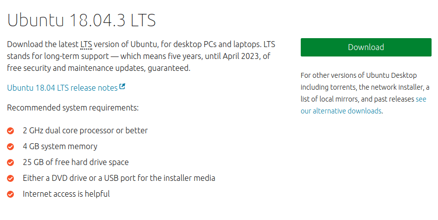

+++
image = "06ebab7d097dc0f8eca4aaf2c3fa0e34.png"
title = "Linux に対する誤解と現実"
publishDate = "2020-01-26T20:46:00+09:00"
lastmod = "2020-01-26T20:46:00+09:00"
tags = [ "Linux" ]
googleAds = true
+++

## 1. はじめに

　近年，Android を搭載した端末の普及や[日経 Linux](https://info.nikkeibp.co.jp/media/LIN/) などの書籍が登場したことによって Linux がより身近な存在になりつつあります。しかし，世間で語られている Linux に関する情報の中には古いものや誤解が混じっているものが多々存在しています。そこで，本記事では世間で誤解されやすい Linux に関する情報について記述します。

## 2. インストールするのが難しい

　これはディストリビューションに大きく左右されます。Ubuntu 系のディストリビューションですと GUI インストーラーが付属しているので簡単にインストールすることができます。インストールする際の設定項目も少ないので，個人的には Windows 10 より簡単にインストールすることができます。その一方，Arch 系のディストリビューションは専門性の高い知識が要求されます。Arch 系のディストリビューションでも [Manjaro](https://manjaro.org/) のようなユーザーフレンドリーを目指したディストリビューションも存在しますが，Ubuntu 系のディストリビューションと比較すると大きくハードルが上がります。

## 3. セキュアなのでセキュリティ対策は不要

　マイナビニュースが公開している[データ](https://news.mynavi.jp/article/20191001-902574/)によると Windows や MacOS に比べると Linux のシェア率は非常に低いです。そのため，Windows や MacOS を攻撃対象としたマルウェアの数に比べると Linux を攻撃対象としたマルウェアの数も少ない傾向になります。これが世間で Linux はセキュアであるといわれる原因の 1 つです。しかし，Linux を攻撃対象としたマルウェアも存在します。そのため，アンチウィルスの導入や怪しいファイルを実行しないなどの基本的なセキュリティリテラシーは Linux であっても必要です。

## 4. 低スペックのパソコンでも動作する

　これはデスクトップ環境に大きく左右されます。例えば [GNOME](https://www.gnome.org/) や [KDE](https://kde.org/) などの有名なデスクトップ環境は Windows 10 と同等のメモリを必要とします。事実として，GNOME を採用している [Ubuntu 18.04.3 LTS](https://ubuntu.com/download/desktop) は 2GHz デュアルコア搭載の CPU，4GB のメモリ，25GB のストレージを推奨スペックとしています。その一方で，[LXDE](https://lxde.org/) や [Xfce](http://www.xfce.org/) などの軽量デスクトップ環境は要求されるスペックも低いため，低スペックなパソコンでもストレスなく動作されることができます。

## 5. 動作するソフトウェアが少ない

　Windows API や Cocoa などの各 OS に依存した API を叩いて GUI を実装するネイティブアプリケーションが主流だった時代は，Linux で動作するソフトウェアの数は多くありませんでした。しかし，近年は HTML5・CSS3・JavaScript などの Web 技術が発展してきたことや，[Electron](https://www.electronjs.org/) などの Web 技術を活用したフレームワークが多く登場したことによりマルチプラットフォームに対応したソフトウェアが多く登場しています。そのため，有名なソフトウェアであれば Linux でも問題なく動作することが多くなってきました。しかし，Windows や MacOS に対応したソフトウェアに比べると少ないのも現実です。

## 6. おわりに

　ここまで，世間で誤解されやすい Linux に関する情報について記述してきました。筆者も Ubuntu 14.04 LTS の頃から Linux を触ってきましたが，ここ数年で飛躍的に使いやすくなっていると感じます。しかし，技術の発展に情報が置いていかれている状況をよく見ます。本記事が Linux 発展の一助になれば幸いです。