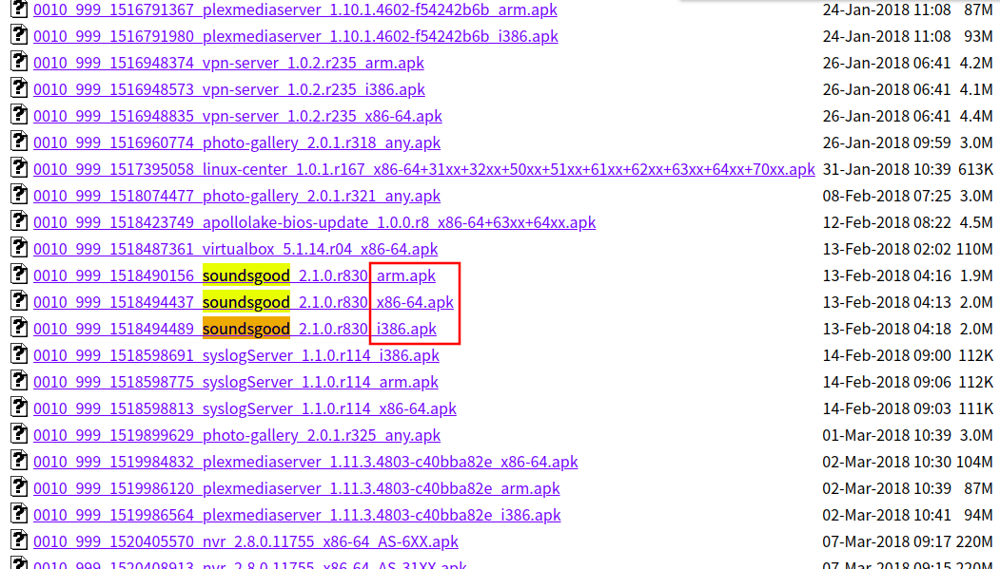

+++
slug = "aa6dc4e5a115938aa963634973139373"
image = ""
title = "ASUSTOR のアプリをダウングレードする方法"
publishDate = "2018-07-04T00:00:00+09:00"
lastmod = "2018-07-04T00:00:00+09:00"
tags = ["ASUSTOR", "NAS"]
googleAds = true
+++

## 1. はじめに

　本記事は，ASUSTOR のアプリをダウングレードする方法を記述した記事である。続く 2 章では，作業を行った環境に関する情報を記述する。3 章では，アプリをダウングレードする手順について記述する。4 章では，本記事のまとめを記述する。

## 2. 環境情報

　下記で行う作業は以下の環境下で行ったものである。

 * Arch Linux
 * Google Chrome Ver.66.0.3359.170
 * AS-202TE
 * AMD Ver.3.1.4.RID1

## 3. アプリのダウングレード

### 3.1. 事前準備

　ダウングレードを行うために以下の作業を行う必要があります。

 * 管理者権限を持つアカウントに切り替える
 * ダウングレードするアプリを削除する

### 3.2. APK のダウンロード

　[公式リポジトリ](http://appdownload.asustor.com/) にアクセスし，ダウングレードしたいアプリの APK をダウンロードする。アプリは 32bit 版・64bit 版・ARM 版が存在するため，各々が所持する NAS に合ったアプリをダウンロードする（図 1）。

図 1 公式リポジトリ

### 3.3. アプリのインストール

　以下の作業を行い，アプリのインストールを行う。

  1. 「App Center」を起動する
  2. 「手動インストール」を選択する
  3. 前節でダウンロードした APK をアップロードする
  4. 必要なフォルダ・依存アプリに関して確認する
  5. 外部 APK をインストールするリスクに対して同意する
  6. アプリをインストールする

## 4. おわりに

　本記事では，ASUSTOR のアプリをダウングレードする方法を記述した。本記事が ASUSTOR の NAS を愛用するユーザの参考になれば幸いである。

## 参照資料

 * [ASUSTOR USER GUIDE Ver.2.4.0730](http://download.asustor.com/download/docs/User_Guide/ADM24/ASUSTOR_NAS_USER_GUIDE_JPN_2.4.0730.pdf)
