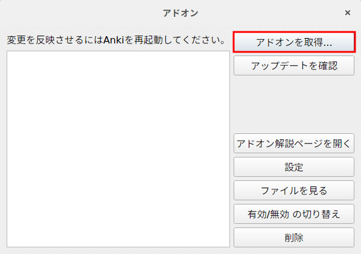
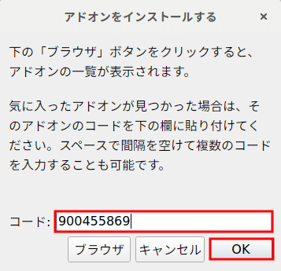
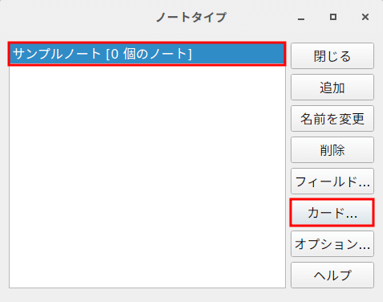
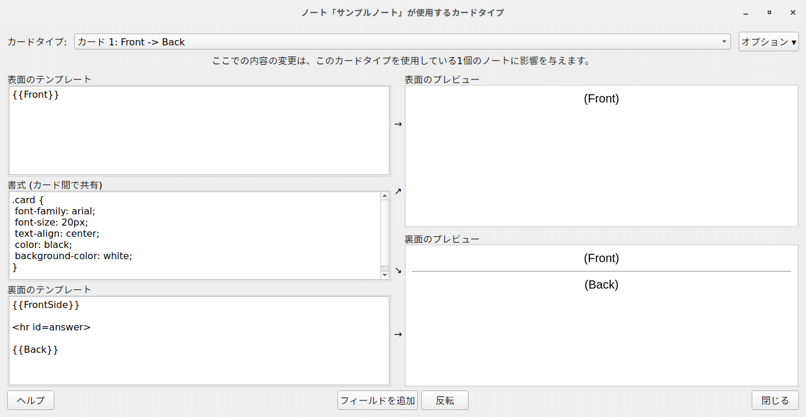
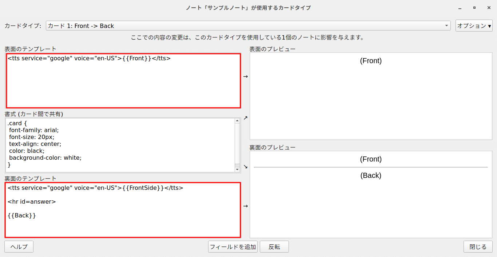

+++
slug = "367b43a223ff73e699e7582bb09037f5"
image = ""
title = "Anki 上で AwesomeTTS を用いて Text to Speech を実装する"
publishDate = "2018-01-09T00:00:00+09:00"
lastmod = "2019-02-10T00:00:00+09:00"
tags = ["Anki", "AwesomeTTS"]
googleAds = true
+++

## 1. 概要

本記事は学習支援フリーソフトウェアである Anki 上でアドオンの AwesomeTTS を用いて Text to Speech を実装する手順を記述した記事である。

## 2. 環境情報

下記で行う作業は以下の環境下で行ったものである。

 * Antergos (Arch Linux)
 * Anki Ver.2.1.0beta29

## 3. 必要なパッケージをインストールする

Linux で Text to Speech を使用する場合は MPlayer が必要なので，以下のコマンドでインストールする（図 1）。

```bash
# pacman -S --noconfirm mplayer
```

<center>図 1 MPlayer のインストールコマンド</center>

## 4. AwesomeTTS をインストールする

以下の作業を行い，Anki 上に AwesomeTTS をインストールする。

1. 「ツール」→「アドオン」をクリックし，アドオンの管理画面（図 2）を開く
2. 「アドオンを取得する」をクリックし，アドオンのインストール画面（図 3）を開く
3. Anki のバージョンが 2.0.x なら 301952613 を，2.1.x なら 900455869 を「コード」に入力する
4. 「OK」ボタンをクリックする
5. アドオンの管理画面を閉じる
6. アドオンを反映させるために Anki を再起動させる



<center>図 2 アドオンの管理画面</center>



<center>図 3 アドオンのインストール画面</center>

## 5. ノートタイプをカスタマイズする

AwesomeTTS をインストールするだけでは Text to Speech は機能しないので，以下の作業でを行い，ノートタイプをカスタマイズする。

1. 「ツール」→「ノートタイプを管理」をクリックし，ノートタイプの管理画面（図 4）を開く
2. 任意のノートをクリックする
3. 「カードタイプ」をクリックし，カードタイプ管理画面（図 5）を開く
4. 「表面のテンプレート」に以下の TTS タグ（図 6）を書き込む
5. 「裏面のテンプレート」に以下の TTS タグ（図 7）を書き込む
6. カードタイプ管理画面の「閉じる」をクリックする
7. ノートタイプの管理画面の「閉じる」をクリックする



<center>図 4 ノートタイプの管理画面</center>



<center>図 5 カードタイプ管理画面（編集前）</center>

```HTML
<tts service="google" voice="en-US">{{Front}}</tts>
```

<center>図 6 表面のテンプレート</center>

```HTML
<tts service="google" voice="en-US">{{FrontSide}}</tts>

<hr id=answer>

{{Back}}
```

<center>図 7 裏面のテンプレート</center>



<center>図 8 カードタイプ管理画面（編集後）</center>

## 6. まとめ

本記事の作業によって実装した Text to Speech の欠点として，オンライン状態でのみ機能するという点がある。そのため，オフライン状態で Anki を使用するユーザは注意が必要である。

## 参考資料

* [Anki Manual](https://apps.ankiweb.net/docs/manual.html)
* [Anki日本語マニュアル Wiki*](http://wikiwiki.jp/rage2050/)
* [AwesomeTTS: Easily add text-to-speech to your Anki cards](https://ankiatts.appspot.com/)
