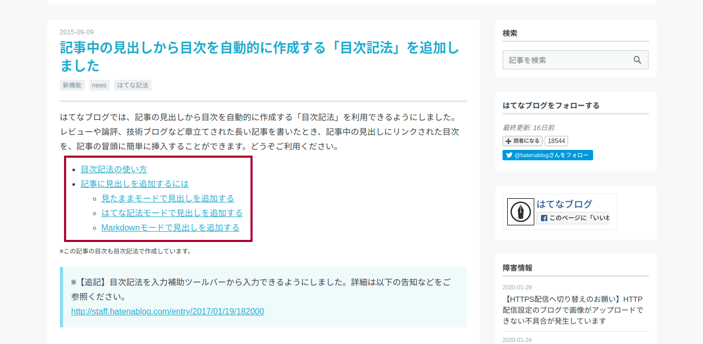
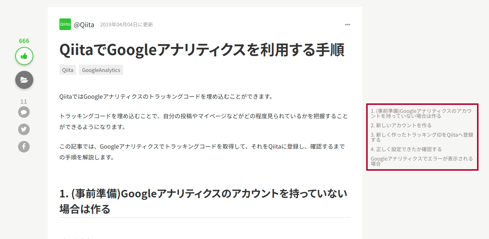
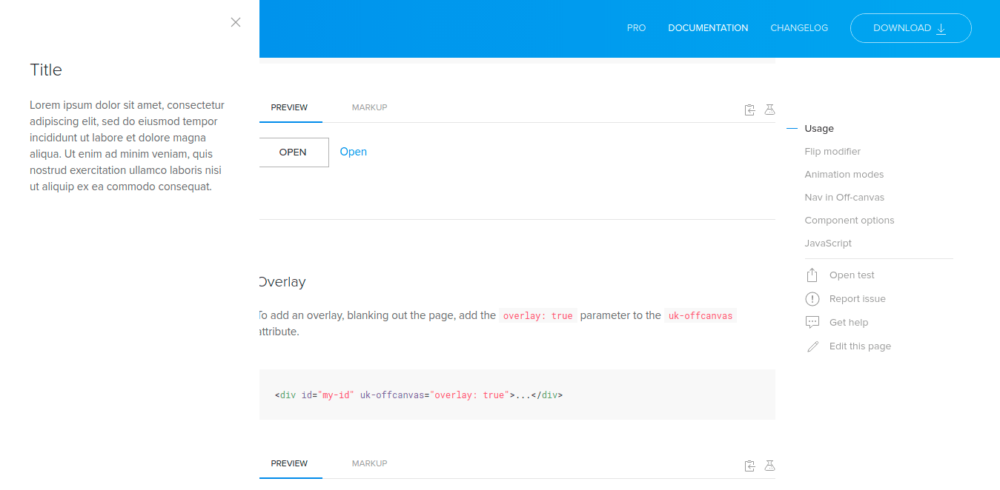
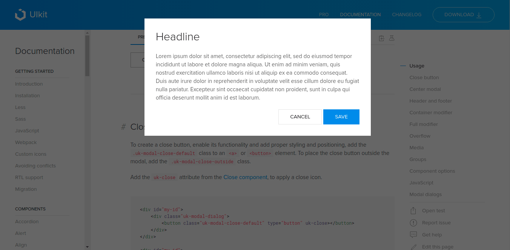
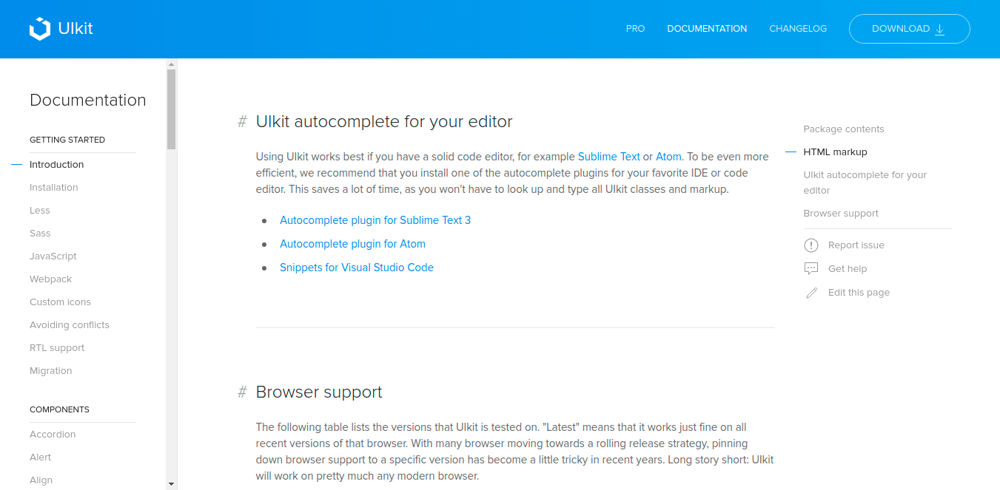

+++
slug ="table-of-contents-best-practices"
image = "b48223ee34723e093b3c9abb84d39cec.png"
title = "Web サイトにおける目次 (Table of contents) のベストプラクティス"
publishDate = "2020-02-23T01:35:00+0900"
lastmod = "2021-03-02T05:05:00+0900"
tags = [ "Design", "UX" ]
googleAds = true
aliases = [
  "/590c49b57be1b54ddfada21ccaafadc0",
  "/column-table-of-contents-best-practices"
]
+++

## 1. はじめに

　TOC とは，Table of contents の頭文字を取った略称であり，日本語では[目次](https://www.wikiwand.com/ja/%E7%9B%AE%E6%AC%A1)と言われます。馴染みが深いところだと書籍や論文などの冒頭に記述されている見出しの集合体が TOC にあたります。近年では，この TOC が Web サイトにも設置されるようになってきました。本記事では，Web サイトに TOC を設置する場合のベストプラクティスについて記述します。

## 2. 配置場所

　TOC が設置されている場所は，Web サイトによって様々です。TOC が設置されている場所によって，UX は大きく変化します。例えば，[はてなブログ](https://hatenablog.com/)では導入しているテーマによって差はありますが，記事題名と記事本文の間に設置される場合が多いです。書籍や論文などと同様の形態で馴染み深いですが，読者が TOC を参照する際に上部までスクロールしないといけないため，UX が高いとは言えません。

　[Qiita](https://qiita.com/) では，TOC が右サイドバーに設置されており，ページをスクロールしても追随するように設計されています。これによって，読者は自分がどの部分を読んでいるのか，また全体のどれぐらいを読み終わったなどを瞬時に把握することができます。

## 3. モバイルデザイン

　近年は，レスポンシブデザインが当たり前の時代になっているため，モバイル向けの TOC についても設計する必要があります。はてなブログのように記事題名と記事本文の間に設置される場合は，デスクトップとモバイルで共通のデザインになるため問題ありません。しかし，Qiita のように TOC がサイドバーに設置されている場合はモバイル向けのデザインを設計する必要があります。具体的な対策として，[オフキャンパスメニュー](https://getuikit.com/docs/offcanvas)や[モーダルウィンドウ](https://getuikit.com/docs/modal)に TOC を設置することが挙げられます。

## 4. エフェクト

　TOC をサイドバーに固定設置することによって，読者は自分がどの部分を読んでいるかを瞬時に判断することができます。また，[UIkit](https://getuikit.com/docs/introduction) のようにアンカーやカラーチェンジなどのエフェクトを追加することで，より一層の UX 向上が見込めます。

## 5. おわりに

　ここまで，Web サイトに TOC を設置する場合のベストプラクティスについて記述してきました。本記事で述べたものは，筆者の経験に基づいたことをまとめたものであり，総計的なデータは存在しません。そのため，本記事で述べたものが全てだと思わず，開発者自身のベストプラクティスを探求して欲しいと思います。