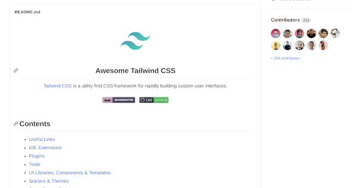
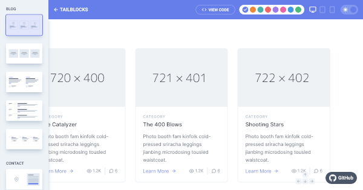
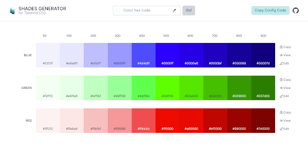
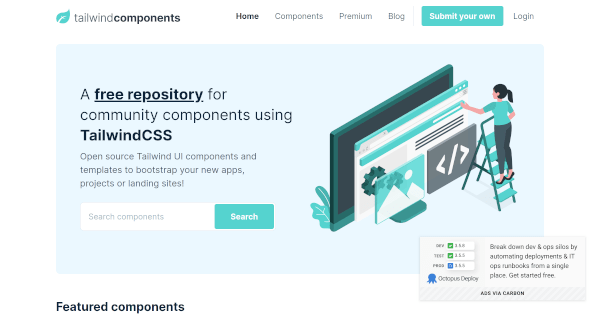
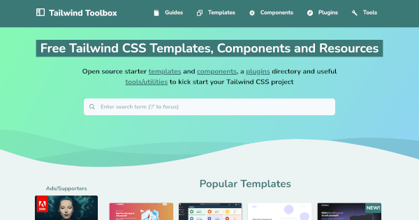
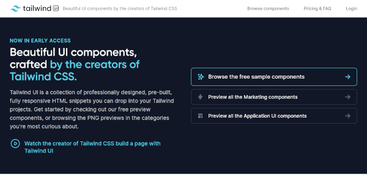
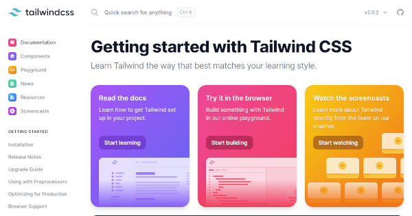
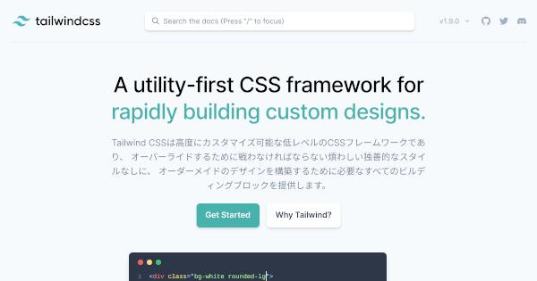

+++
slug = "tailwind-css-learning-development-support-site-tool"
image = "c1090e2c651cce9c7b348fd3d5155914.png"
title = "Tailwind CSS の学習と開発を支援するサイトとツール"
publishDate = "2020-12-18T00:46:00+0900"
lastmod = "2020-12-18T00:46:00+0900"
tags = ["Tailwind CSS", "CSS"]
weight = 0
googleAds = true
draft = true
+++

## 1. はじめに

　[Tailwind CSS](https://tailwindcss.com/) は，FLOSS で開発されているユーティリティ指向の CSS フレームワークです。[Bootstrap](https://getbootstrap.com/) や [UIkit](https://getuikit.com/) などのコンポーネント指向の CSS フレームワークと比較すると知名度は高くないですが，新しいパラダイムの CSS フレームワークとして注目され初めています。本記事では，Tailwind CSS の学習と開発を支援するサイトとツールを厳選して紹介します。

## 2. Awesome Tailwind CSS

## 3. Meraki UI

## 4. tailblocks

## 5. Tailwind Color Shades Generator

## 6. Tailwind Components

## 7. Tailwind Toolbox

## 8. Tailwind UI

## 9. 公式ドキュメント

## 10. 日本語ドキュメント

## 11. おわりに

　XXX