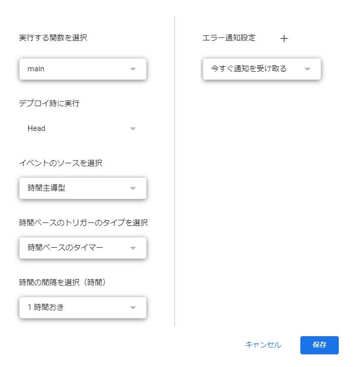

+++
slug = "delete-twitter-tweets-periodically-using-google-apps-script"
image = "14202f8c2a5582219cf162b0bb1b93a4.png"
title = "Google Apps Script を用いて定期的に Twitter のツイートを削除する"
publishDate = "2019-06-06T00:00:00+0900"
lastmod = "2020-12-21T02:50:19+0900"
tags = ["Tech", "Google Apps Script"]
googleAds = true
aliases = ["/aff6f0cd316165fe425ae87f4b34bbd5"]
+++

## 1. はじめに

　近年，[Snapchat](https://www.snapchat.com/) や [Instagram Stories](https://business.instagram.com/blog/introducing-instagram-stories) などの一定時間が経過すると自動的に投稿が削除される，エフェメラル SNS と呼ばれるサービスが登場しています。
　本記事では，Google Apps Script を用いて Twitter に投稿されてから 7 日以上が経過したツイートを自動的に削除することで，Twitter をエフェメラル SNS 化するシステムの構築について記述します。

## 2. 事前準備

### 2.1. Twitter

　[Twitter Developers](https://developer.twitter.com/) に登録して，以下の情報を取得します。

 * CONSUMER_KEY
 * CONSUMER_SECRET
 * ACCESS_TOKEN
 * ACCESS_TOKEN_SECRET

### 2.2. Google Apps Script
　Google Apps Script のプロジェクトを作成し，OAuth 認証のライブラリが OSS として [Github](https://github.com/gsuitedevs/apps-script-oauth1/blob/master/LICENSE) に公開されているので，手順に従ってインストールします。


## 3. 実装

　以下のスクリプトを作成した Google Apps Script のプロジェクトに追加します。大括弧の部分は各自の情報に置換してください。

```js
function main() {
  
  const CONSUMER_KEY        = "[CONSUMER_KEY]"
  const CONSUMER_SECRET     = "[CONSUMER_SECRET]"
  const ACCESS_TOKEN        = "[ACCESS_TOKEN]"
  const ACCESS_TOKEN_SECRET = "[ACCESS_TOKEN_SECRET]"
  const CURRENT_TIME        =  new Date();
  
  // OAuth 認証
  const getTwitterService = function() {
    return OAuth1.createService( "Twitter" )
    .setAccessTokenUrl( "https://api.twitter.com/oauth/access_token" )
    .setRequestTokenUrl( "https://api.twitter.com/oauth/request_token" )
    .setAuthorizationUrl( "https://api.twitter.com/oauth/authorize" )
    .setConsumerKey( CONSUMER_KEY )
    .setConsumerSecret( CONSUMER_SECRET )
    .setAccessToken( ACCESS_TOKEN, ACCESS_TOKEN_SECRET );
  };
  
  // タイムラインを取得する
  // JSON に変換する
  const response = getTwitterService().fetch( "https://api.twitter.com/1.1/statuses/user_timeline.json?count=200" );
  const json = JSON.parse( response );
  
  // 投稿から 7 日以上経過しているツイートをフィルタリングする
  // ツイートの ID を取得する
  // ツイートを削除する
  json.filter(function( x ){
    const createdTime      = new Date( x["created_at"] );
    const diffTimeMillisec = CURRENT_TIME - createdTime;
    return (1000 * 60 * 60 * 24 * 7) < diffTimeMillisec
  }).map(function( x ){
    return x["id_str"]
  }).forEach(function( x ){
    getTwitterService().fetch(
      "https://api.twitter.com/1.1/statuses/destroy/" + x + ".json",
      { method: 'POST' }
    );
  });
  
}
```

　最後に，上記で作成した main 関数を[トリガー](https://script.google.com/home/triggers)に登録します。以下のようにトリガーに登録することで main 関数が定期的に実行されるようになります。



## 4. おわりに

　定期的にツイートを削除してくれるサービスとして [TweetDelete](https://www.tweetdelete.net/) が存在します。しかし，TweetDelete の削除頻度は高くなく，指定した期間以上のツイートが残ってしまいます。削除頻度が気にならない人は，TweetDelete を利用するのも有効な方法だと思います。