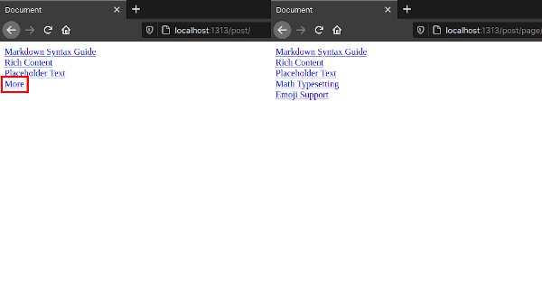

+++
slug = "implementing-pseudo-infinite-scrolling-hugo"
image = "1e3806bfc2b8dc42f6b7426f0436a0cf.png"
title = "Hugo で擬似的な無限スクロールを実装する"
publishDate = "2019-10-23T11:39:00+0900"
lastmod = "2020-12-22T00:13:24+0900"
tags = ["Tech", "Hugo"]
googleAds = true
aliases = ["/33c3300936a09740c0cee182bf873825"]
+++

## 1. はじめに

　[Hugo](https://gohugo.io/) は，ページネーションがテンプレートとして標準搭載されています。しかし，無限ページングのテンプレートは標準搭載されていないため，フルスクラッチで実装する必要があります。実装するに当たって (1) JavaScript を用いて実装する方法と (2) Hugo の機能で実装する方法が考えられます。(1) と (2) は，共に[ソースコード](https://mikeroibu.com/post/hugo-infinite-scrolling/)が公開されているので，公開されているソースコードを活用します。また，本記事内で行っている作業は，以下の環境下で実行したものです。

 * Hugo Ver.0.75.1
 * Zorin OS 15 Core (Ubuntu 18.04 LTS)

## 2. ソースコード

　公開されているソースコードに手を加えたものを以下に示します。一般的な無限ページングは，JavaScript を用いて DOM を操作することで実現しています。しかし，公開されているソースコードは Hugo に標準搭載されているページネーションの機能を応用して擬似的な無限ページングを実現しています。

```HTML {linenos=table}
{{ $paginator := .Paginate .Pages }}
{{ $pageSize := $paginator.PageSize }}
{{ $totalPostsToShow := mul $paginator.PageNumber $pageSize }}
{{ range $index, $el := (first $totalPostsToShow .Pages) }}
<div {{ if eq $index (sub $totalPostsToShow $pageSize) }} id="bottom" {{ end }}>
    <a href="{{ .Permalink }}">{{ .Title }}</a>
</div>
{{ end }}
{{ if and (gt $paginator.TotalPages 1) ($paginator.HasNext) }}
<a class="nextpage" href="{{ $paginator.Next.URL }}#bottom">More</a>
{{ end }}
```

## 3. 実行環境構築

　[hugoBasicExample](https://github.com/gohugoio/hugoBasicExample) をベースに，実行環境を構築します。まずは，GitHub のリポジトリから hugoBasicExample を任意のディレクトリにクローンし，*./hugoBasicExample/layouts/_default* ディレクトリ直下に *section.html* を作成します。

```bash
$ pwd
$ /home/admin
$ git clone https://github.com/gohugoio/hugoBasicExample.git
$ cd hugoBasicExample
$ mkdir ./layouts/_default/
$ touch ./layouts/_default/section.html
$ tree
.
├── LICENSE
├── README.md
├── config.toml
├── configTaxo.toml
├── content
│   ├── _index.md
│   ├── about.md
│   ├── archives.md
│   ├── homepage
│   │   ├── about.md
│   │   ├── index.md
│   │   └── work.md
│   └── post
│       ├── _index.md
│       ├── emoji-support.md
│       ├── markdown-syntax.md
│       ├── math-typesetting.md
│       ├── placeholder-text.md
│       └── rich-content.md
├── layouts
│   └── _default
│       └── section.html
└── static

10 directories, 18 files
```

　上記で作成した *section.html* を以下のソースコードに書き換えます。

```html
<!DOCTYPE html>
<html lang="en">

<head>
    <meta charset="UTF-8">
    <meta name="viewport" content="width=device-width, initial-scale=1.0">
    <title>Document</title>
</head>

<body>
    {{ $paginator := .Paginate .Pages }}
    {{ $pageSize := $paginator.PageSize }}
    {{ $totalPostsToShow := mul $paginator.PageNumber $pageSize }}
    {{ range $index, $el := (first $totalPostsToShow .Pages) }}
    <div {{ if eq $index (sub $totalPostsToShow $pageSize) }} id="bottom" {{ end }}>
        <a href="{{ .Permalink }}">{{ .Title }}</a>
    </div>
    {{ end }}
    {{ if and (gt $paginator.TotalPages 1) ($paginator.HasNext) }}
    <a class="nextpage" href="{{ $paginator.Next.URL }}#bottom">More</a>
    {{ end }}
</body>

</html>
```

## 4. 動作確認

　*hugoBasicExample* ディレクトリ直下に移動し，*hugo server* を実行します。正常に実行されると，http://localhost:1313/ に Web サーバーが立ち上がります。しかし，http://localhost:1313/ にアクセスしても index.html を設置していないため，ブラウザ上には何も表示されません。section.html の内容を表示させるために，*http://localhost:1313/post/* にアクセスします。

```bash
$ pwd
$ /home/admin/hugoBasicExample
$ hugo server

                   | EN  
-------------------+-----
  Pages            | 19  
  Paginator pages  |  1  
  Non-page files   |  0  
  Static files     |  1  
  Processed images |  0  
  Aliases          | 10  
  Sitemaps         |  1  
  Cleaned          |  0  

Built in 13 ms
Watching for changes in /home/admin/hugoBasicExample/{content,layouts,static}
Watching for config changes in /home/admin/hugoBasicExample/config.toml
Environment: "development"
Serving pages from memory
Running in Fast Render Mode. For full rebuilds on change: hugo server --disableFastRender
Web Server is available at http://localhost:1313/ (bind address 127.0.0.1)
Press Ctrl+C to stop
```

　ブラウザで *http://localhost:1313/post/* にアクセスすると，ブラウザ上に 3 つの記事タイトルと More ボタンが表示されます。表示されている More ボタンをクリックすることで，新たに 2 つの記事タイトルが表示されれば正常に動作しています。



## 5. おわりに

　ここまで，Hugo に標準搭載されている機能を用いて擬似的な無限スクロールを実装する手順について記述してきました。擬似的な無限スクロールですが，完全な無限ページングと比較しても機能的な差はなく，ストレスを感じるようなこともありませんでした。また，*config.toml* の *paginate* に設定されている数値を変更することで，表示される記事数を変更することが出来ます。