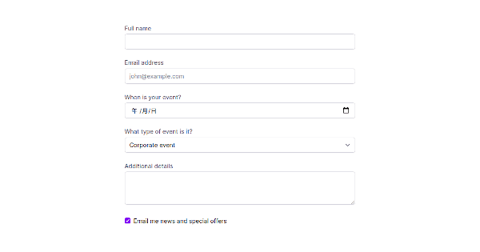

+++
slug = "customize-form-tailwind-css"
image = "c1090e2c651cce9c7b348fd3d5155914.png"
title = "Tailwind CSS でフォームをカスタマイズする"
publishDate = "2020-12-28T15:04:02+0900"
lastmod = "2020-12-28T15:04:02+0900"
tags = ["Tech", "Tailwind CSS", "CSS"]
weight = 1
googleAds = true
+++

## 1. はじめに

　[Tailwind CSS](https://tailwindcss.com/) でフォームをカスタマイズする場合，input タグや select タグ，textarea タグなどのフォーム部品を直接カスタマイズすることも出来ますが，公式のプラグイン ([tailwindcss-forms](https://github.com/tailwindlabs/tailwindcss-forms) と [tailwindcss-custom-forms](https://github.com/tailwindlabs/tailwindcss-custom-forms)) が公開されているので，プラグインを用いてカスタマイズする方法がオススメです。

　tailwindcss-custom-forms は，フォーム要素にクラス名を記述する必要がありますが，tailwindcss-forms は，自動的にフォーム要素をカスタマイズしてくれます。また，[Awesome Tailwind CSS](https://github.com/aniftyco/awesome-tailwindcss) でも，tailwindcss-custom-forms は非推奨に分類されているので，本記事では tailwindcss-forms を用いてフォームをカスタマイズする手順を記述します。

　以降の章で行っている作業は，以下の環境下で実行したものです。また，npm や npx はインストール済みの前提で記述しており，インストール手順は割愛していることをご了承ください。

* npm Ver.6.14.9
* npx Ver.6.14.9
* Zorin OS 15.2 Core (Ubuntu 18.04 LTS)

## 2. 環境構築

　(1) 動作確認用の *index.html* を生成します  
　(2) 初期化処理を行い *package.json* を生成します  
　(3) *Tailwind CSS* と *tailwindcss-forms* をインストールします  
　(4) Tailwind CSS の設定ファイルである *tailwind.config.js* を生成します

```bash
$ touch index.html ・・・ (1)
$ npm init -y ・・・ (2)
$ npm install tailwindcss@latest @tailwindcss/forms ・・・ (3)
$ npx tailwindcss-cli@latest init ・・・ (4)
$ ls
index.html  node_modules  package-lock.json
package.json  tailwind.config.js
```

　上記で生成した *index.html* と *tailwind.config.js* を，それぞれ以下のように書き換えます。

```html
<!DOCTYPE html>
<html lang="en">

<head>
  <meta charset="UTF-8">
  <meta name="viewport" content="width=device-width, initial-scale=1.0">
  <title>Tailwind CSS Forms</title>
  <link href="tailwind.css" rel="stylesheet" />
</head>

<body>
  <form class="grid grid-cols-1 gap-6 m-16">
    <label class="block">
      <span class="text-gray-700">Full name</span>
      <input type="text"
        class="mt-1 block w-full rounded-md border-gray-300 shadow-sm focus:border-indigo-300 focus:ring focus:ring-indigo-200 focus:ring-opacity-50"
        placeholder="">
    </label>
    <label class="block">
      <span class="text-gray-700">Email address</span>
      <input type="email"
        class="mt-1 block w-full rounded-md border-gray-300 shadow-sm focus:border-indigo-300 focus:ring focus:ring-indigo-200 focus:ring-opacity-50"
        placeholder="john@example.com">
    </label>
    <label class="block">
      <span class="text-gray-700">When is your event?</span>
      <input type="date"
        class="mt-1 block w-full rounded-md border-gray-300 shadow-sm focus:border-indigo-300 focus:ring focus:ring-indigo-200 focus:ring-opacity-50">
    </label>
    <label class="block">
      <span class="text-gray-700">What type of event is it?</span>
      <select
        class="block w-full mt-1 rounded-md border-gray-300 shadow-sm focus:border-indigo-300 focus:ring focus:ring-indigo-200 focus:ring-opacity-50">
        <option>Corporate event</option>
        <option>Wedding</option>
        <option>Birthday</option>
        <option>Other</option>
      </select>
    </label>
    <label class="block">
      <span class="text-gray-700">Additional details</span>
      <textarea
        class="mt-1 block w-full rounded-md border-gray-300 shadow-sm focus:border-indigo-300 focus:ring focus:ring-indigo-200 focus:ring-opacity-50"
        rows="3"></textarea>
    </label>
    <div class="block">
      <div class="mt-2">
        <div>
          <label class="inline-flex items-center">
            <input type="checkbox"
              class="rounded border-gray-300 text-indigo-600 shadow-sm focus:border-indigo-300 focus:ring focus:ring-indigo-200 focus:ring-opacity-50"
              checked="">
            <span class="ml-2">Email me news and special offers</span>
          </label>
        </div>
      </div>
    </div>
  </form>
</body>

</html>
```

```js
module.exports = {
  purge: [],
  darkMode: false, // or 'media' or 'class'
  theme: {
    extend: {},
  },
  variants: {
    extend: {},
  },
  plugins: [
    require('@tailwindcss/forms'),
  ],
}
```

　最後に，ビルド処理を行い，*tailwind.css* が正常に生成されれば環境構築は完了です。

```bash
$ npx tailwindcss-cli@latest build -o tailwind.css
  
   tailwindcss 2.0.2
  
   🚀 Building from default CSS... (No input file provided)
  
   ✅ Finished in 3.58 s
   📦 Size: 3.75MB
   💾 Saved to tailwind.css
  
$ ls
index.html  node_modules  package-lock.json
package.json  tailwind.config.js  tailwind.css
```

## 3. 動作確認

　上記で生成した *index.html* を任意のブラウザで開き，以下のようにフォームがカスタマイズされていれば正常に動作しています。この他にも，様々なカスタマイズをすることが出来ます。詳しくは，tailwindcss-forms の [README.md](https://github.com/tailwindlabs/tailwindcss-forms/blob/master/README.md) や[ライブデモ](https://tailwindcss-forms.vercel.app/)を参照して下さい。



## 4. おわりに

　ここまで，Tailwind CSS の公式プラグインである tailwindcss-forms を用いて，フォームをカスタマイズする手順について記述してきました。公式のプラグイン以外にも，有志の方々が開発，公開している[プラグイン](https://github.com/aniftyco/awesome-tailwindcss#plugins)も存在するので，自分に合ったものを見つけて使ってみて下さい。