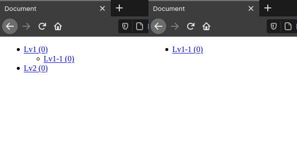

+++
slug = "implement-section-tree-list-hugo"
image = "1e3806bfc2b8dc42f6b7426f0436a0cf.png"
title = "Hugo でセクションツリーリストを実装する"
publishDate = "2021-01-11T01:24:33+0900"
lastmod = "2021-01-11T01:24:33+0900"
tags = ["Tech", "Hugo"]
weight = 0
googleAds = true
+++

## 1. はじめに

　Hugo では，タグやカテゴリーなどを設定できる [Taxonomy](https://gohugo.io/content-management/taxonomies/) 機能の他に，content フォルダ内の階層構造に対応したツリー構造が生成できる [Section](https://gohugo.io/content-management/sections/) 機能がデフォルトで提供されています。Section 機能を用いることで，SEO 対策で有効とされている「パンくずリスト」などを容易に実装することが出来ます。本記事では，セクションツリーリストを実装する手順について記述します。また，本記事で行っている作業は Hugo Ver.0.80.0 と Zorin OS 15 Core (Ubuntu 18.04 LTS) の環境下で実行したものです。Hugo は，インストール済みの前提で記述しており，インストール手順などは割愛していることを，ご了承下さい。

## 2. ソースコード

　セクションツリーリストを表示するソースコードを以下に示します。ソースコードは，(1) 1 〜 15 行目の *define* を用いてテンプレートを定義している部分と，(2) 16 行目の *template* を用いてテンプレート呼び出している部分の大きく 2 つで構成されています。

　(1) では，3 〜 13 行目がループし，ループ内の 11 行目で template を用いて (1) を再帰的に呼び出すことで階層構造に対応しています。また，(2) では 16 行目の引数として *.Site* を渡すことで，ルート以外の Section ページでも，全てのセクション名を表示することが出来ます。

```html {linenos=table}
{{ define "section-tree-list" }}
<ul>
  {{ range .Sections }}
    <li>
      <a href="{{.Permalink}}">
        {{ .Title }}
        ({{ len .RegularPagesRecursive }})
      </a>
    </li>
    {{ if (len .Sections) }}
      {{ template "section-tree-list" . }}
    {{ end }}
  {{ end }}
</ul>
{{ end }}
{{ template "section-tree-list" .Site }}
```

## 3. 実行環境構築

　まず初めに，Hugo コマンドを用いて Hugo のテンプレートを作成します (1) 。次に，*_default* フォルダの直下に，*section.html* を作成します (2) 。最後に，*content* フォルダ内にフォルダと *_index.md* を作成します (3) 。Hugo では，content フォルダ内で _index.md が存在するフォルダが Section として認識されるので，必ず _index.md を作成しておきます。

```bash
# (1)
$ hugo new site quickstart
$ cd quickstart
$ ls
archetypes  config.toml  content  data  layouts  static  themes

# (2)
$ mkdir ./layouts/_default
$ touch ./layouts/_default/section.html
$ tree ./layouts/
./layouts/
└── _default
    └── section.html

1 directory, 1 file

# (3)
$ mkdir ./content/Lv1
$ mkdir ./content/Lv1/Lv1-1
$ mkdir ./content/Lv2
$ touch ./content/Lv1/_index.md
$ touch ./content/Lv1/Lv1-1/_index.md
$ touch ./content/Lv2/_index.md
$ echo -e -n "+++\ntitle=\"Lv1\"\n+++" > ./content/Lv1/_index.md
$ echo -e -n "+++\ntitle=\"Lv1-1\"\n+++" > ./content/Lv1/Lv1-1/_index.md
$ echo -e -n "+++\ntitle=\"Lv2\"\n+++" > ./content/Lv2/_index.md
$ tree ./content/
./content/
├── Lv1
│   ├── Lv1-1
│   │   └── _index.md
│   └── _index.md
└── Lv2
    └── _index.md

3 directories, 3 files
```

　上記で作成した *section.html* を以下のように書き換えます。

```html
<!DOCTYPE html>
<html lang="en">

<head>
  <meta charset="UTF-8">
  <meta name="viewport" content="width=device-width, initial-scale=1.0">
  <title>Section Tree List</title>
</head>

<body>
  {{ define "section-tree-list" }}
  <ul>
    {{ range .Sections }}
    <li>
      <a href="{{.Permalink}}">
        {{ .Title }}
        ({{ len .RegularPagesRecursive }})
      </a>
    </li>
    {{ if (len .Sections) }}
    {{ template "section-tree-list" . }}
    {{ end }}
    {{ end }}
  </ul>
  {{ end }}
  {{ template "section-tree-list" .Site }}
</body>

</html>
```

## 4. 動作確認

　Hugo Server を起動し，*http://localhost:1313/lv1/* に任意の Web ブラウザを用いてアクセスします。引数として *.Site* を設定した場合 (左) と，*.* を設定した場合 (右) の実行結果を以下に示します。*.Site* を引数として設定した場合は，Section ページでも全てのセクション名が表示されています。一方で，*.* を引数として設定した場合は，現在の Section 下に存在するセクション名のみが表示されています。これは，*.Site* にはサイトのルートに関する情報が，*.* には現在の Section に関する情報が格納されているためです。



## 5. おわりに

　ここまで，セクションツリーリストを実装する手順について記述してきました。「セクションツリーリスト」はブログサイトにとって，基本的にはウィジェットですが，公式サイトでは「パンくずリスト」のサンプルコードは記載されているが，「セクションツリーリスト」のサンプルコードが記載されていなかったり，Section ページで全てのセクション名を表示させるには引数を工夫する必要があるなど，躓く点が複数ありました。本記事が，Hugo テーマ開発者の参考になれば幸いです。