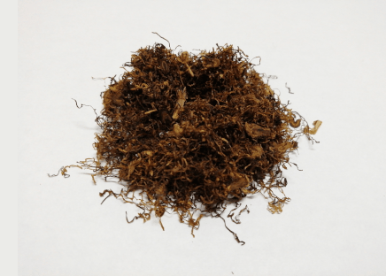

+++
slug = "drum-original"
image = "482965cbf9151846c87e151226972d04.png"
title = "シャグレビュー: DRUM ORIGINAL"
publishDate = "2020-12-09T14:44:26+0900"
lastmod = "2020-12-09T14:44:26+0900"
tags = ["DRUM"]
aliases = ["/shag-review-drum", "/review-shag-drum"]
+++

## 1. 商品概要

| 項目 | 内容 |
|---|---|
| 商品名 | DRUM ORIGINAL |
| 原産国 | オランダ |
| 内容量 | 50g |
| 販売価格 | 約 1,330 円 |
| グラム単価 | 約 26.6 円/g |

　[DRUM](https://rpx.a8.net/svt/ejp?a8mat=3BDYDP+AUKDMA+2HOM+BWGDT&rakuten=y&a8ejpredirect=https%3A%2F%2Fhb.afl.rakuten.co.jp%2Fhgc%2Fg00pq7a4.2bo11488.g00pq7a4.2bo12d31%2Fa20052522171_3BDYDP_AUKDMA_2HOM_BWGDT%3Fpc%3Dhttps%253A%252F%252Fitem.rakuten.co.jp%252Fplaza%252F10014953%252F%26m%3Dhttp%253A%252F%252Fm.rakuten.co.jp%252Fplaza%252Fi%252F10014953%252F) は，世界中で非常に人気の高いハーフスワレ系のシャグです。内容量が 50g で約 1,330 円，グラム単価が約 26.6 円/g です。グラム単位としては約 26.6 円/g と，一般的な価格帯になりますが，内容量が 50g と他のシャグと比較すると少し多いので購入の際は注意が必要です。また，ローリングペーパーとして，RIZLA+ の Orange が付属しています。RIZLA+ の Orange は，フリーバーニングタイプのローリングペーパーで，50 枚入りです。

## 2. 初期状態

　開封直後は，ハーフスワレ系特有の鰹節のような香りが立ち込めます。適度が湿度が保たれているため，加湿作業も必要ないと思います。しかし，葉脈や茎などが混入しているため，気になる人は除去作業が必要になるかもしれません。

## 3. 喫煙感想

　まずは，Smoking の No.8 Brown + フィルター無しで喫煙しました。非常に強いコクと香りを堪能することが出来ます。それでいて，適切な湿度が保たれているので，後味もスッキリとしています。しかし，序盤から中盤は美味しいのですが，中盤から終盤は刺激は強いため，口の中がピリピリとしてきます。

　次に，Smoking の No.8 Brown + ZIG-ZAG REGULAR FILTERS で喫煙しました。フィルター無しの状態と比較すると，香りは弱まってしまいますが，しっかりとコクが残っており，非常に美味しいです。また，中盤以降も美味しく吸うことが出来ました。

## 4. 総合評価

　世界中で人気である理由が納得できるシャグでした。ハーフスワレ系シャグの入門としてオススメしたいですが，内容量が 50g と少し多めなので，まずは内容量が 25g と少ないハーフスワレ系の [che shag Blue](https://rpx.a8.net/svt/ejp?a8mat=3BDYDP+AUKDMA+2HOM+BWGDT&rakuten=y&a8ejpredirect=https%3A%2F%2Fhb.afl.rakuten.co.jp%2Fhgc%2Fg00pq7a4.2bo11488.g00pq7a4.2bo12d31%2Fa20052522171_3BDYDP_AUKDMA_2HOM_BWGDT%3Fpc%3Dhttps%253A%252F%252Fitem.rakuten.co.jp%252Fplaza%252F10014746-114%252F%26m%3Dhttp%253A%252F%252Fm.rakuten.co.jp%252Fplaza%252Fi%252F10017625%252F) を試して，ハーフスワレ系のシャグが合いそうなら DRUM を購入するという手もオススメです。