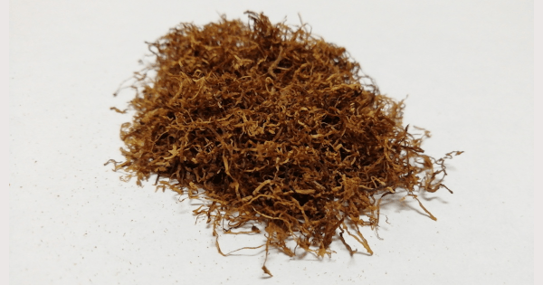

+++
slug = "che-black-menthol"
image = "1278daad59f0473b41a7a825b0572685.png"
title = "シャグレビュー: che Black Menthol"
publishDate = "2020-12-12T10:12:30+0900"
lastmod = "2020-12-12T10:12:30+0900"
tags = ["che"]
aliases = ["/review-shag-che-black-menthol"]
+++

## 1. 商品概要

| 項目 | 内容 |
|---|---|
| 商品名 | che Black Menthol |
| 原産国 | ルクセンブルク |
| 内容量 | 25g |
| 販売価格 | 約 640 円 |
| グラム単価 | 約 25.6 円/g |

　[che Black Menthol](https://rpx.a8.net/svt/ejp?a8mat=3BDYDP+AUKDMA+2HOM+BWGDT&rakuten=y&a8ejpredirect=https%3A%2F%2Fhb.afl.rakuten.co.jp%2Fhgc%2Fg00pq7a4.2bo11488.g00pq7a4.2bo12d31%2Fa20052522171_3BDYDP_AUKDMA_2HOM_BWGDT%3Fpc%3Dhttps%253A%252F%252Fitem.rakuten.co.jp%252Fplaza%252F10014747%252F%26m%3Dhttp%253A%252F%252Fm.rakuten.co.jp%252Fplaza%252Fi%252F10014747%252F) は，ルクセンブルクで生産されているメンソール系のシャグです。内容量が 25g で，販売価格が約 640 円。よって，グラム単価が約 25.6 円/g になります。その他のシャグと比較すると，グラム単価が約 10 円ほど安いです。また，ローリングペーパーとして漂白 + スローバーニングのオリジナルローリングペーパーが付属しています。

## 2. 初期状態

　開封直後は，シャグ本来の香りが感じられます。また，シャグの香りと同時に清涼感を感じるほどメンソールが強いです。開封の時点でメンソールがダメな人は拒否反応を起こすと思います。

　シャグの状態ですが，湿度も適切に保たれており，目立った葉脈や茎などの混入も少ないです。そのため，加湿作業や除去作業も必要ないと思います。

## 3. 喫煙感想

　まずは，Smoking Brown Thinnest + フィルター無しの状態で喫煙しました。普段，KOOL 12mg を常喫している筆者でも*強い*と感じるほどメンソールが強いです。体感的に，Seven Stars Menthol 12mg と同等レベルでメンソールが強いです。メンソールが強すぎると，CAMEL CIGARS MENTHOL のように煙感が感じられなくなることがありますが，che Black Menthol は強烈なメンソールに負けないぐらい煙感がしっかりと感じることが出来ました。

　次に，Smoking Brown Thinnest + ZIG-ZAG REGULAR FILTERS で喫煙しました。フィルター有りの状態で，体感的に KOOL 12mg と同等ぐらいのメンソールになっていると思います。メンソールと煙感のバランスが良く，非常に美味しいです。

## 4. 総合評価

　グラム単位が，その他のシャグと比較して約 10 円ほど安いにもかかわらず，非常に美味しいというコストパフォーマンスに優れたシャグでした。KOOL 12mg や Marlboro Menthol 12mg などのメンソール系の紙巻きタバコが好きな人にオススメです。また，内容量が 25g と少ないため，色々試したい初心者の人も手に取りやすいシャグだと思います。