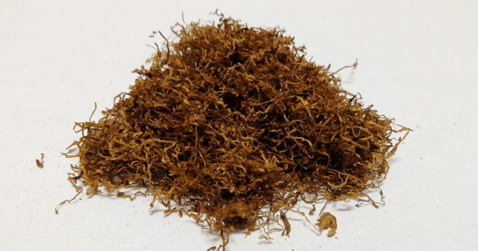

+++
slug = "che-menthol"
image = "5570ab4d09773d6918e84d5c96b315b0.png"
title = "シャグレビュー: che Menthol"
publishDate = "2020-12-12T10:49:17+0900"
lastmod = "2020-12-12T10:49:17+0900"
tags = ["che"]
aliases = ["/review-shag-che-menthol"]
+++

## 1. 商品概要

| 項目 | 内容 |
|---|---|
| 商品名 | che Menthol |
| 原産国 | ルクセンブルク |
| 内容量 | 25g |
| 販売価格 | 約 640 円 |
| グラム単価 | 約 25.6 円/g |

　[che Menthol](https://rpx.a8.net/svt/ejp?a8mat=3BDYDP+AUKDMA+2HOM+BWGDT&rakuten=y&a8ejpredirect=https%3A%2F%2Fhb.afl.rakuten.co.jp%2Fhgc%2Fg00pq7a4.2bo11488.g00pq7a4.2bo12d31%2Fa20052522171_3BDYDP_AUKDMA_2HOM_BWGDT%3Fpc%3Dhttps%253A%252F%252Fitem.rakuten.co.jp%252Fplaza%252F10014748-ps%252F%26m%3Dhttp%253A%252F%252Fm.rakuten.co.jp%252Fplaza%252Fi%252F10017917%252F) は，ルクセンブルクで生産されているメンソール系のシャグです。内容量が 25g で，販売価格が約 640 円。よって，グラム単価が約 25.6 円/g になります。その他のシャグと比較すると，グラム単価が約 10 円ほど安いです。また，ローリングペーパーとして漂白 + スローバーニングのオリジナルローリングペーパーが付属しています。

## 2. 初期状態

　開封直後は，シャグ本来の香りが感じられます。開封の時点では，[che Black Menthol](https://rpx.a8.net/svt/ejp?a8mat=3BDYDP+AUKDMA+2HOM+BWGDT&rakuten=y&a8ejpredirect=https%3A%2F%2Fhb.afl.rakuten.co.jp%2Fhgc%2Fg00pq7a4.2bo11488.g00pq7a4.2bo12d31%2Fa20052522171_3BDYDP_AUKDMA_2HOM_BWGDT%3Fpc%3Dhttps%253A%252F%252Fitem.rakuten.co.jp%252Fplaza%252F10014747%252F%26m%3Dhttp%253A%252F%252Fm.rakuten.co.jp%252Fplaza%252Fi%252F10014747%252F) ほどのメンソールは感じられませんでした。また，シャグの状態ですが che Black Menthol と同様に湿度も適切に保たれており，目立った葉脈や茎などの混入も少ないです。そのため，加湿作業や除去作業も必要ないと思います。

## 3. 喫煙感想

　まずは，Smoking Brown Thinnest + フィルター無しの状態で喫煙しました。メンソールの強さと煙感のバランスが良く，フィルター無しの状態でも非常に美味しいです。やはり，che Black Menthol に比べるとメンソールが抑えられている印象です。

　次に，Smoking Brown Thinnest + ZIG-ZAG REGULAR FILTERS で喫煙しました。普段，KOOL 12mg を常喫している筆者からすると，少しメンソールが弱いかなという印象です。5mg 〜 8mg のメンソール系タバコを吸われている人は丁度よい塩梅だと思います。

## 4. 総合評価

　グラム単位が，その他のシャグと比較して約 10 円ほど安いにもかかわらず，非常に美味しいというコストパフォーマンスに優れたシャグでした。そのまま吸っても非常に美味しいのですが，フレーバー系のシャグとブレンドしても楽しめるシャグだと思います。