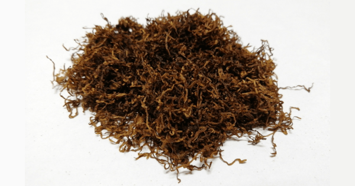

+++
slug = "choice-dark-chocolate"
image = "e009c64f6f8807fb887cf59abc3e13be.png"
title = "シャグレビュー: CHOICE DARK CHOCOLATE"
publishDate = "2020-12-12T14:09:37+0900"
lastmod = "2020-12-12T14:09:37+0900"
tags = ["CHOICE"]
aliases = ["/review-shag-choice-dark-chocolate"]
+++

## 1. 商品概要

| 項目 | 内容 |
|---|---|
| 商品名 | CHOICE DARK CHOCOLATE |
| 原産国 | デンマーク |
| 内容量 | 30g |
| 販売価格 | 約 800 円 |
| グラム単価 | 約 26.7 円/g |

　[CHOICE DARK CHOCOLATE](https://rpx.a8.net/svt/ejp?a8mat=3BDYDP+AUKDMA+2HOM+BWGDT&rakuten=y&a8ejpredirect=https%3A%2F%2Fhb.afl.rakuten.co.jp%2Fhgc%2Fg00pq7a4.2bo11488.g00pq7a4.2bo12d31%2Fa20052522171_3BDYDP_AUKDMA_2HOM_BWGDT%3Fpc%3Dhttps%253A%252F%252Fitem.rakuten.co.jp%252Fplaza%252Fstd-airyo107-xs%252F%26m%3Dhttp%253A%252F%252Fm.rakuten.co.jp%252Fplaza%252Fi%252F10017896%252F) は，ビターチョコレートの香りが着香されたフレーバー系のシャグです。内容量が 30g で，販売価格が約 800 円。よって，グラム単価が約 26.7 円/g となっており，一般的な価格帯のシャグになります。また，ローリングペーパーとして MAC BAREN 社製のローリングペーパー (漂白 + フリーバーニング) が付属しています。

## 2. 初期状態

　開封直後は，強烈なチョコレートの香りが立ち込めます。市販されているビターチョコというよりは，ウイスキーボンボンのようにラム酒の香りが少し混じったような香りです。シャグの状態は，湿度も適切に保たれており，目立った葉脈や茎などの混入も少ないです。そのため，加湿作業や除去作業も必要ないと思います。

## 3. 喫煙感想

　まずは，Smoking Brown Thinnest + フィルター無しの状態で喫煙しました。燃焼時は，開封直後に感じたウイスキーボンボンのような香りからバターチョコレートのような香りに変わりました。煙感は控えめであり，代わりにフレーバーの濃厚な香りが立ち込めます。

　次に，Smoking Brown Thinnest + ZIG-ZAG REGULAR FILTERS で喫煙しました。フィルター無しの状態と同じく，バターチョコレートのような香りが漂います。フィルター有りの状態でも，濃厚な香りが漂います。

## 4. 総合評価

　チョコレートフレーバーのシャグとしては非常に完成度が高いシャグだと思います。しかし，香りが非常に強いため，単体で吸うと少し胸焼けしそうになります。そのため，個人的には単体で吸うよりもブレンドでアクセント用に使う方が良い気がします。