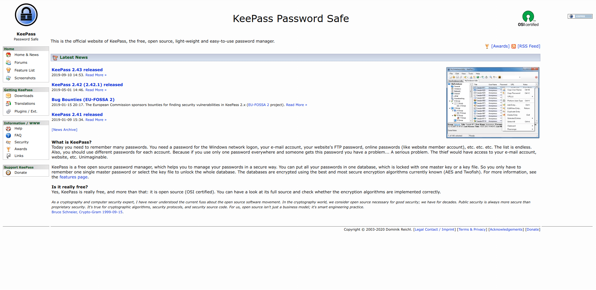
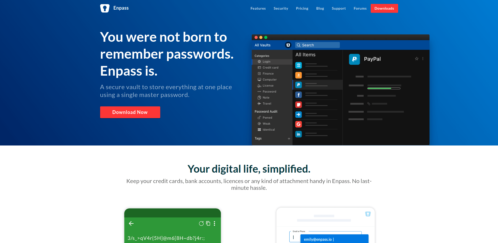
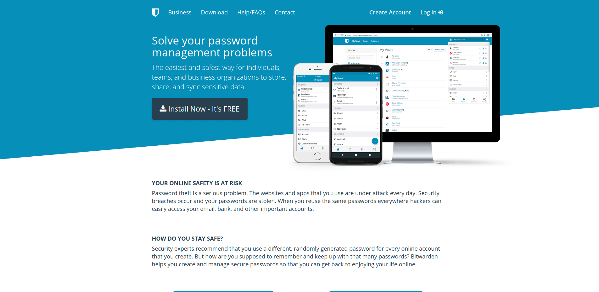

+++
image = "8c70c4a1bbd066c471737212ad25c008.png"
title = "パスワード管理ツールを比較・評価する"
date = "2020-01-12T05:45:00+09:00"
lastmod = ""
tags = [ "GUI", "LifeHack", "Security" ]
googleAds = true
+++

## 1. はじめに

　近年，様々なサービスが登場したことによって個人が管理するアカウント数は増え続けています。それと共に不正アクセスなどのセキュリティ問題も増え続けています。セキュアな状態を保ちつつアカウントを管理するにはパスワード管理ツールが必要不可欠になりつつあります。本記事では，有名なパスワード管理ツールを比較・評価します。

## 2. KeePass

　[KeePass](https://keepass.info/) は，オープンソースかつクロスプラットフォーム対応のパスワード管理ツールです。自動入力やパスワード生成などの基本機能の他にプラグインによる機能拡張も可能。しかしソフトウェア自体に自動同期機能が実装されていないため，複数の端末でデータを同期する場合は Dropbox や Google Drive などのクラウドストレージサービスを利用した疑似同期を設定する必要がある。

　⭕ オープンソースソフトウェア  
　⭕ 無料で使用可能  
　❌ レガシーアーキテクチャ  
　❌ 公式のサーバーが存在しない  

## 3. Enpass

　[Enpass](https://www.enpass.io/) は，Sinew Software Systems 社が開発しているクロスプラットフォーム対応のパスワード管理ツールです。パスワード管理ツールに必要な機能は網羅的に実装されている。しかし，Sinew Software Systems 社は同期サーバーを提供していないためクラウドストレージサービスやユーザー自身の WebDAV サーバーを介した同期しかできない。また，モバイルアプリは 10 個までしかデータを同期できないため有料版の購入が必須。

　⭕ モダンアーキテクチャ  
　❌ プロプライエタリソフトウェア  
　❌ モバイルアプリが有料  
　❌ 公式のサーバーが存在しない  

## 4. Bitwarden

　[Bitwarden](https://bitwarden.com/) は，8bit Solutions LLC が開発しているオープンソースかつクロスプラットフォーム対応のパスワード管理ツールです。現在のところデメリットとして挙げる点が見つからないほど洗練されているパスワード管理ツールです。有料版が存在しますが個人で使用する分には無料版で問題ありません。

　⭕ オープンソースソフトウェア  
　⭕ モダンアーキテクチャ  
　⭕ 公式のサーバーが存在する  
　⭕ 無料で使用可能  

## 5. おわりに

　現状，Bitwarden 以外のパスワード管理ツールを使用するメリットが少ないと思われます。8bit Solutions LLC が提供するパスワード管理サーバーが信用できない場合は，セルフホスティングするための Docker も用意されています。特別な理由がない限りは Bitwarden を利用することをおすすめします。