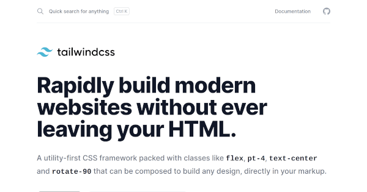

+++
slug = "column-hugo-tailwind-alpine-netlify-cms-build-jamstack-blog"
image = "cfc29025d9a0575216282544e099e8d0.png"
title = "Hugo + Tailwind CSS + Alpine.js + Netlify CMS を用いた JAMStack なブログサイトの構築"
publishDate = 2020-12-03T16:57:01.472Z
lastmod = ""
tags = ["Column", "Hugo", "Tailwind CSS", "Alpine.js", "Netlify CMS"]
weight = 0
draft = false
googleAds = true
+++
## 1. はじめに

　本ブログサイトは，Go 言語製の静的サイトジェネレーターである Hugo とユーティリティ指向の CSS フレームワークである Tailwind CSS，軽量型の JavaScript フレームワークである Alpine.js，Netlify 社が提供している静的ウェブサイトである Netlify，同じく Netlify 社が提供しているヘッドレス CMS である Netlify CMS を用いて構築しています。

　これらのソフトウェアやサービスは，Hugo と Gastby.js，Tailwind CSS と Boostrap，Alpine.js と Vue.js，Netlify と Vercel，Netlify CMS と microCMS など，類似するものが多く存在します。これらのソフトウェアやサービスから，自分に適したソフトウェアやサービスを比較，選択するのは大きな労力がかかります。

　そこで，本記事では JAMStack なブログサイトを構築，もしくは運用しようと考えている人に向け，上記のソフトウェアとサービスの概要，選択した理由，使用した感想などを記述します。また，ブログ記事を作成してから公開するまでのシステムアーキテクチャについても記述します。

## 2. Hugo

　Hugo は，Go 言語製の静的サイトジェネレーターであり，静的サイトジェネレーターの中でもトップクラスの[人気](https://jamstack.org/generators/)と[パフォーマンス](https://qiita.com/tnzk/items/4863e2c559f6b71b72e0#%E6%A4%9C%E8%A8%BC%E7%B5%90%E6%9E%9C)が特徴的です。

要求分析の段階では，Go 言語製の静的サイトジェネレーターということもあり，Go 言語に関する知識が必要になるかもしれないという懸念点がありました。しかし，ブログサイトを構築する分には Go 言語の知識が必要になる場面は存在しませんでした。

Hugo は Go 言語標準のテンプレートエンジンや組み込み関数を用いているため，Go 言語の知識があればスムーズに学習と開発が行えると思います。

## 3. Tailwind CSS

　Tailwind CSS は，ユーティリティ指向の CSS フレームワークであり，バニラ CSS を書かなくてもユニークな UI を構築することが可能です。有名な CSS フレームワークとして [Bootstrap](https://getbootstrap.com/) や [UIkit](https://getuikit.com/) などが挙げられます。これらの CSS フレームワークは，既存のコンポーネントを組み合わせることで UI を構築していくコンポーネント指向の CSS フレームワークです。

　本ブログサイトは，Bootstrap → UIkit → Tailwind CSS の順で CSS フレームワークを採用してきました。コンポーネント指向の CSS フレームワークは，既存のコンポーネントを組み合わせるだけなので，非デザイナーの筆者でも簡単に統一されたデザインの UI を構築することが出来ました。しかし，既存のコンポーネントをカスタマイズする場合や足りないコンポーネントを追加する場合は，バニラ CSS を記述する必要があり，UI の独自性が上がるほど CSS フレームワークの利点が下がるジレンマに陥りました。

　上記のジレンマを解消するため，ユーティリティ指向の CSS フレームワークである Tailwind CSS に乗り換えました。結果的に，バニラ CSS を 1 行も記述することなく独自の UI を構築することができ，CSS ファイルのサイズも大幅に削減することが出来ました。

## Alpine.js

　XXX

## Netlify

　XXX

## Netlify CMS

　XXX

## システムアーキテクチャ

　XXX

## おわりに

　XXX