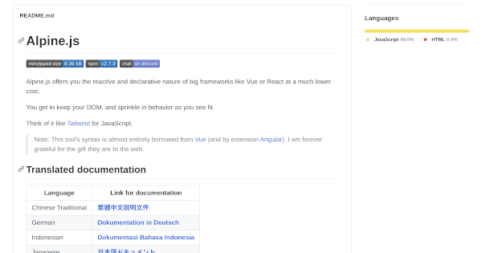
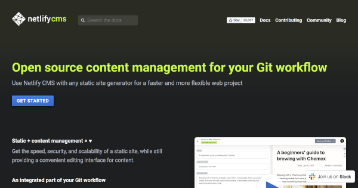

+++
slug = "survey-hugo-tailwindcss-alpinejs-netlify-cms-development-jamstack-blog"
image = "cfc29025d9a0575216282544e099e8d0.png"
title = "Hugo + Tailwind CSS + Alpine.js + Netlify CMS を用いた JAMStack なブログサイトの開発後記"
publishDate = 2020-12-03T20:54:49.707Z
lastmod = ""
tags = ["Survey", "Hugo", "Tailwind CSS", "Alpine.js", "Netlify CMS"]
weight = 0
draft = false
googleAds = true
+++
## 1. はじめに

　本ブログサイトは，Go 言語製の静的サイトジェネレーターである Hugo とユーティリティ指向の CSS フレームワークである Tailwind CSS，軽量型の JavaScript フレームワークである Alpine.js，Netlify 社が提供している静的ウェブサイトである Netlify，同じく Netlify 社が提供しているヘッドレス CMS である Netlify CMS を用いて構築しています。

　開発の過程において，JAMStack なブログサイトの開発で頻繁に用いられているソフトウェアとサービスを可能な限り調査しました。そこで，本記事では JAMStack なブログサイトを構築，もしくは運用しようと考えている人に向け，上記のソフトウェアとサービスの概要，選択した理由，使用した感想などを記述します。具体的な使用方法や運用手順は割愛しているのでご了承下さい。

## 2. Hugo

　Hugo は，Go 言語製の静的サイトジェネレーターであり，静的サイトジェネレーターの中でもトップクラスの[人気](https://jamstack.org/generators/)と[パフォーマンス](https://qiita.com/tnzk/items/4863e2c559f6b71b72e0#%E6%A4%9C%E8%A8%BC%E7%B5%90%E6%9E%9C)が特徴的です。

要求分析の段階では，Go 言語製の静的サイトジェネレーターということもあり，Go 言語に関する知識が必要になるかもしれないという懸念点がありました。しかし，ブログサイトを構築する分には Go 言語の知識が必要になる場面は存在しませんでした。

Hugo は Go 言語標準のテンプレートエンジンや組み込み関数を用いているため，Go 言語の知識があればスムーズに学習と開発が行えると思います。

## 3. Tailwind CSS

　Tailwind CSS は，ユーティリティ指向の CSS フレームワークであり，バニラ CSS を書かなくてもユニークな UI を構築することが可能です。有名な CSS フレームワークとして [Bootstrap](https://getbootstrap.com/) や [UIkit](https://getuikit.com/) などが挙げられます。これらの CSS フレームワークは，既存のコンポーネントを組み合わせることで UI を構築していくコンポーネント指向の CSS フレームワークです。

　本ブログサイトは，Bootstrap → UIkit → Tailwind CSS の順で CSS フレームワークを採用してきました。コンポーネント指向の CSS フレームワークは，既存のコンポーネントを組み合わせるだけなので，非デザイナーの筆者でも簡単に統一されたデザインの UI を構築することが出来ました。しかし，既存のコンポーネントをカスタマイズする場合や足りないコンポーネントを追加する場合は，バニラ CSS を記述する必要があり，UI の独自性が上がるほど CSS フレームワークの利点が下がるジレンマに陥りました。

　上記のジレンマを解消するため，ユーティリティ指向の CSS フレームワークである Tailwind CSS に乗り換えました。結果的に，バニラ CSS を 1 行も記述することなく独自の UI を構築することができ，CSS ファイルのサイズも大幅に削減することが出来ました。

## 4. Alpine.js

　Alpine.js は，軽量型の JavaScript フレームワークであり，[Vue.js](https://vuejs.org/) と [AngularJS](https://angularjs.org/) の影響を大きく受けています。また，公式が「Alpine.js は，Tailwind CSS の JavaScript 版」と明言しているため，Tailwind CSS との相性も良いと推測できます。

　Bootstrap や UIkit は，DOM を操作する動的なコンポーネントも含まれていますが，Tailwind CSS には含まれていません。そこで，動的なコンポーネントはフルスクラッチで実装する必要がありました。結果的に，[Tab](https://getuikit.com/docs/tab) や [Toggle](https://getuikit.com/docs/toggle#toggle) などの代表的なコンポーネントは，Alpine.js を用いることでバニラ JavaScript を記述することなく実装することが出来ました。

## 5. Netlify CMS

　Netlify CMS は，Netlify 社が提供しているヘッドレス CMS であり，対応している[静的サイトジェネレーター](https://www.netlifycms.org/docs/start-with-a-template/)と組み合わせることによって，[WordPress](https://wordpress.org/) のように Web 上から記事の作成や編集，投稿を行うことが出来ます。Netlify CMS の他にも数多くの[ヘッドレス CMS](https://jamstack.org/headless-cms/) が存在していますが，公式で Hugo が対応している点と既に静的ウェブサイトホスティングサービスの Netlify を愛用していた点から Netlify CMS を採用しました。

　結果的に，記事の作成や編集，投稿のタイミングで発生する Git コマンドの入力省略，Netlify CMS Editor による Markdown の記述効率化，

に記述することが出来，

## 6. おわりに

　XXX