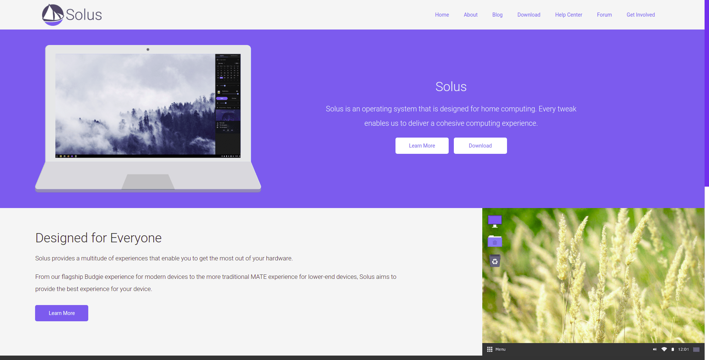
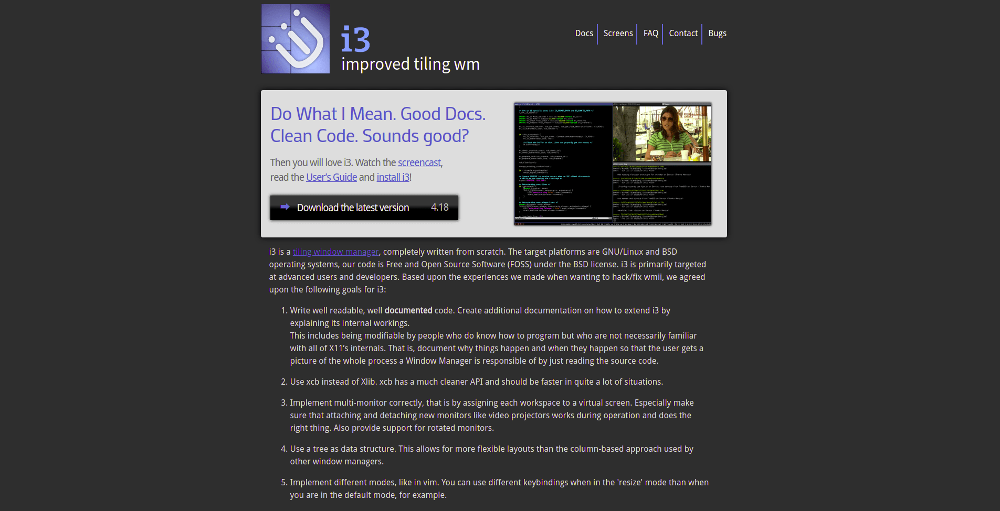
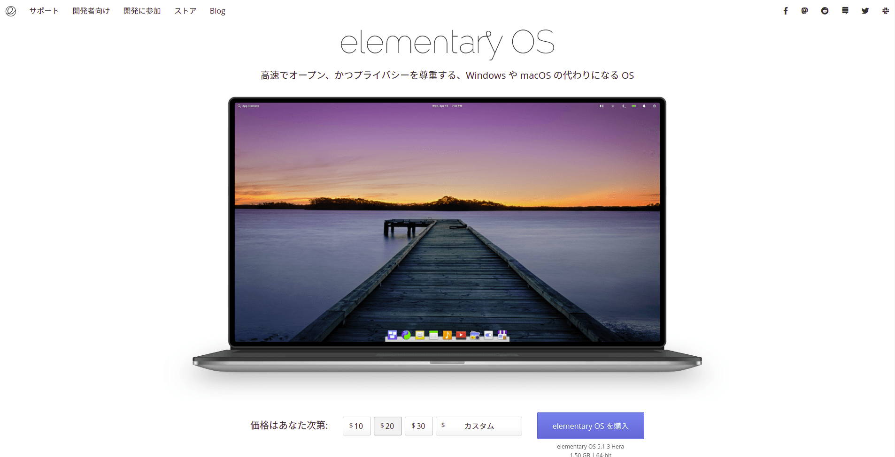
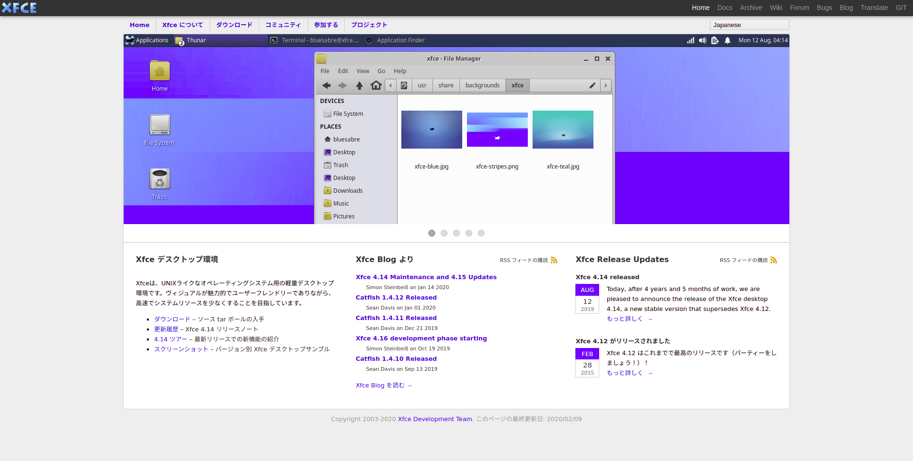
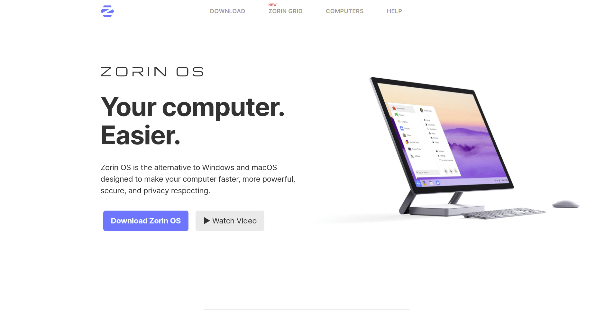

+++
image = "06ebab7d097dc0f8eca4aaf2c3fa0e34.png"
title = "GNOME と KDE の次に試したい Linux デスクトップ環境"
publishDate = "2020-04-20T18:10:00+09:00"
lastmod = ""
tags = [ "GNOME", "KDE", "Linux" ]
googleAds = true
weight = 4
+++

## 1. はじめに

　Linux デスクトップ環境界隈の二大巨頭である GNOME と KDE 以外の Linux デスクトップ環境が増えてきており，次に試す Linux デスクトップ環境が決まらない場面が増えてきました。そこで，本記事では筆者がこれまでに試してきた Linux デスクトップ環境の中からオススメものについて記述します。

## 2. Budgie Desktop

　[Budgie Desktop](https://getsol.us/home/) は，Solus Project によって開発されているデスクトップ環境です。[筆者の記事](/0dc71947e42b397b17b6139d3c9a3834)で述べている通り，シンプルかつエレガントなデザインに，適度なカスタマイズ性を兼ね備えたデスクトップ環境です。しかし，個人的に致命的なバグが数カ所あったため，現在は愛用していません。Budgie Desktop を Ubuntu に移植した [Ubuntu Budgie](https://ubuntubudgie.org/) がオススメです。

## 3. i3wm

　[i3wm](https://i3wm.org/) は， FLOSS で開発されているタイル型ウィンドウマネージャです。スタック型ウィンドウマネージャに慣れているユーザーは，タイル型ウィンドウマネージャ独特の操作に慣れるまで時間がかかりますが，慣れてくるとスタック型ウィンドウマネージャでは味わえない操作感を味わえます。また，本記事で紹介するデスクトップ環境の中で最も軽量であり，低スペックなマシンでも快適に動作します。しかし，外部出力 (モニターやプロジェクター) する際に不具合が発生する場合があるため，頻繁に外部出力するマシンにインストールすることはオススメできません。

## 4. Pantheon

　[Pantheon](https://elementary.io/ja/) は，elementary OS に組み込まれているデスクトップ環境です。macOS ライクなデザイン設計になっており，Windows や macOS の代用を謳っています。デフォルト設定で，すぐに使用できる設計になっており，初心者にも優しいデスクトップ環境だと思います。しかし，カスタマイズ性が非常に低いため，カスタマイズを楽しみたいユーザーにはオススメできません。

## 5. Xfce

　[Xfce](https://www.xfce.org/) は，FLOSS で開発されている軽量なデスクトップ環境です。本記事で紹介するスタック型ウィンドウマネージャの中では最も軽量なデスクトップです。Ubuntu や Arch Linux を始めとした様々な Linux ディストリビューションに移植されており，軽量デスクトップ環境の中ではトップクラスに愛用ユーザーが多いデスクトップ環境でもあります。

## 6. Zorin OS

　[Zorin OS](https://zorinos.com/) は，正確には Ubuntu ベースの Linux ディストリビューションを指す言葉であり，デスクトップ環境を指す言葉ではありません。Zorin OS Core に組み込まれているデスクトップ環境は GNOME をカスタマイズしたデスクトップ環境であり，非常にクオリティの高いデスクトップ環境です。カスタマイズ性は Budgie Desktop と Pantheon の中間ほどであり，カスタマイズ性が高いとは言えませんが，ユーザーフレンドリーなデザイン設計は万人にオススメできるデスクトップ環境です。

## 7. おわりに

　ここまで，筆者がこれまでに試してきた Linux デスクトップ環境の中からオススメものについて記述してきました。筆者は現在，Zorin OS を愛用していますが他の Linux デスクトップ環境に移行しようか悩んでいます。様々なデスクトップ環境を試せるのも Linux を使用する醍醐味の一つだと思います。