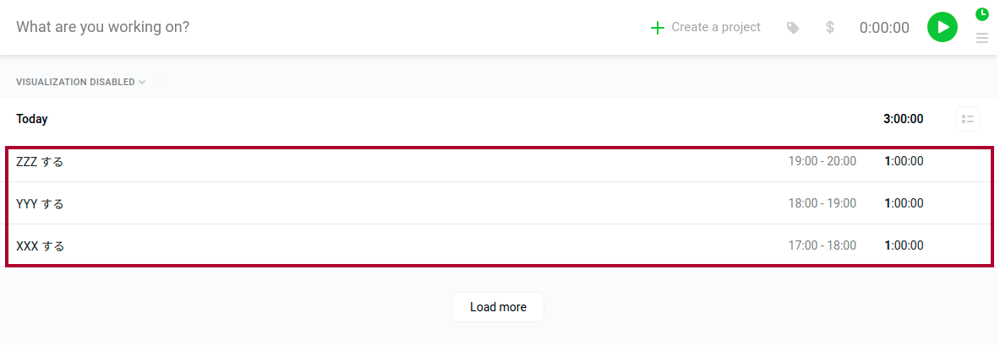
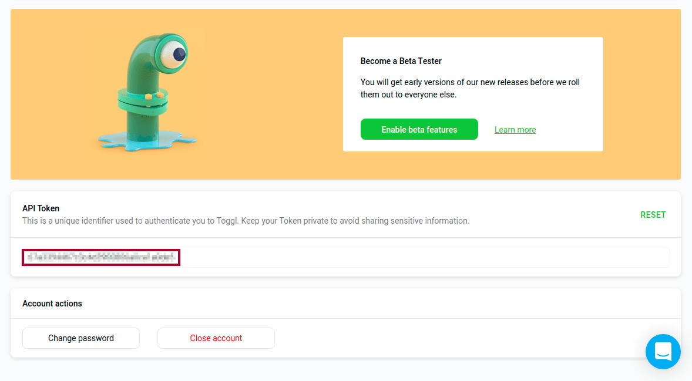
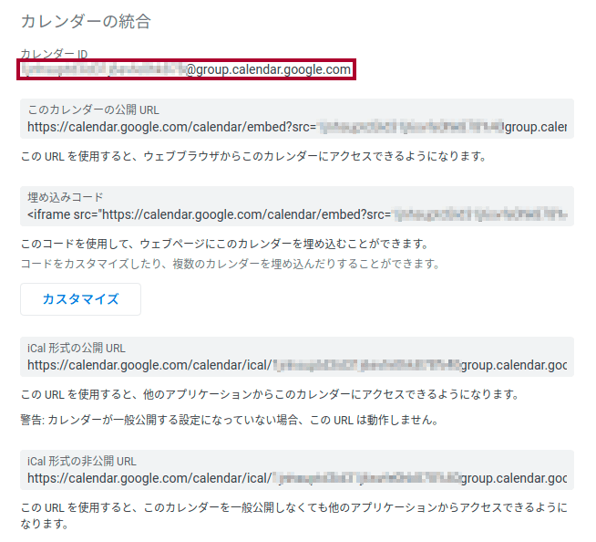

+++
image = "b33340e9f3bf46cfdf5e8da4072a7d48.png"
title = "GAS を用いて Toggl のデータを Google カレンダーに移行する"
publishDate = "2020-02-25T21:06:00+09:00"
lastmod = "2020-02-25T21:06:00+09:00"
tags = ["Tips", "GAS", "Toggl"]
googleAds = true
+++

## 1. はじめに

　筆者は，タイムトラッキングアプリである [Toggl](https://toggl.com/) を日常的に愛用しています。しかし，記録データはワークフローの関係上 Google カレンダーで一括管理したい。そこで，本記事では GAS[^1] を用いて Toggl に記録されているデータを Google カレンダーに一括移行するスクリプトについて記述する。

[^1]: Google Apps Script の略称

## 2. 要件定義

　実現したい要件として，以下の 2 つが挙げられます。

　① Toggl に記録されている Time Entrys を Google カレンダーに移行する  
　② Toggl に記録されている Time Entrys を削除する



## 3. 事前準備

　事前準備として，以下の 2 つを取得する必要があります。

* TOGGL_API_TOKEN
* GOOGLE_CALENDAR_ID

　TOGGL_API_TOKEN は，*Profile settings* に表示されているので記録しておきます。



　GOOGLE_CALENDAR_ID は，*設定と共有* に表示されているので記録しておきます。



## 4. 実装

　[先行記事](https://m-kawaguchi.hatenablog.jp/entry/2017/11/12/Toggl%E3%81%AE%E3%83%AD%E3%82%B0%E3%82%92Google%E3%82%AB%E3%83%AC%E3%83%B3%E3%83%80%E3%83%BC%E3%81%AB%E8%87%AA%E5%8B%95%E8%A8%98%E9%8C%B2%E3%81%99%E3%82%8B%E3%82%B9%E3%82%AF%E3%83%AA%E3%83%97 )と [Toggl API doc](https://github.com/toggl/toggl_api_docs/blob/master/toggl_api.md) を参考に実装したソースコードを以下に示します。*[TOGGL_API_TOKEN]* と *[GOOGLE_CALENDAR_ID]* は，上記で取得した *TOGGL_API_TOKEN* と *GOOGLE_CALENDAR_ID* に置換します。

```js
function main() {
  
  const TOGGL_API_TOKEN = '[TOGGL_API_TOKEN]';
  const GOOGLE_CALENDAR_ID = '[GOOGLE_CALENDAR_ID]';
  
  // 終了時刻が設定されている + タグが付いていない Time Entrys を取得する
  const timeEntrys = JSON.parse(UrlFetchApp.fetch(
    url = 'https://www.toggl.com/api/v8/time_entries',
    params = {
      'method' : 'GET',
      'headers' : {'Authorization' : 'Basic ' + Utilities.base64Encode(TOGGL_API_TOKEN + ':api_token')}, 
      'muteHttpExceptions' : true,
    }
  )).filter(function(x){
    return x.stop && !x.tags
  });
  
  const calApp = CalendarApp.getCalendarById(GOOGLE_CALENDAR_ID);
  
  timeEntrys.forEach(function(x){
    // Google Calendar にイベントを追加する
    calApp.createEvent(
      title = x.description,
      startTime = new Date(x.start),
      endTime = new Date(x.stop)
    );
    // Time Entrys にタグを追加する
    UrlFetchApp.fetch(
      url = 'https://www.toggl.com/api/v8/time_entries/' + x.id,
      params = {
      'method' : 'PUT',
      'headers' : {'Authorization' : 'Basic ' + Utilities.base64Encode(TOGGL_API_TOKEN + ':api_token')}, 
      'contentType': 'application/json',
      'payload' : JSON.stringify({"time_entry":{"tags":['Logged'], "tag_action": "add"}}),
      'muteHttpExceptions' : true,
      }
    )
  });

}
```

　Toggl の Free プランでは，Time Entrys を Delete する API が叩けないため，要件の「② Toggl に記録されている Time Entrys を削除する」を満たすことができません。そこで，Google カレンダーに移行した Time Entrys には *Logged* タグを付与し，*Logged* タグが付いている Time Entrys は Google カレンダー に移行しない仕様としました。

## 5. 運用

　新しい GAS のプロジェクトを作成し，上記のソースコードをコピー&ペーストします。初回実行時は認証手続きが必要になるので，[認証手順記事](https://www.virment.com/step-allow-google-apps-script/)を参考に認証します。また，[トリガー](https://tonari-it.com/gas-trigger-set/)を設定しておくことで，Toggl に記録されている Time Entrys を自動的に Google カレンダーへ移行することができます。

## 6. おわりに

　ここまで，本記事では GAS を用いて Toggl に記録されているデータを Google カレンダーに一括移行するスクリプトについて記述してきました。GAS と Google が提供しているサービスを組み合わせると様々なことができるので，GAS を触ったことない方は GAS で遊んでみてほしいです。

## 環境情報

* Google Chrome Ver.80.0.3987.116
* Zorin OS 15 Core (Ubuntu 18.04 LTS)