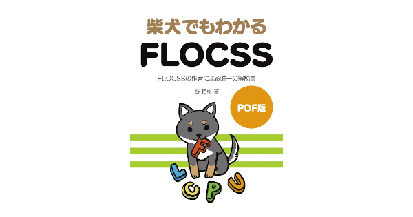
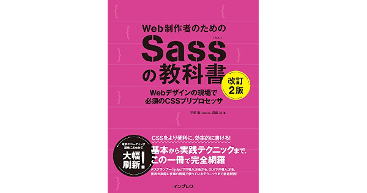

+++
image = "374ab7db8aea6d6ee2f3f3258678c2e0.png"
title = "ブックレビュー: Web 制作者のための CSS 設計の教科書"
date = "2020-07-14T20:37:00+09:00"
lastmod = ""
tags = [
    "Review",
    "Book",
    "CSS",
]
googleAds = true
+++

## 1. はじめに

　「Web 制作者のための CSS 設計の教科書」は，株式会社サイバーエージェントでエンジニアとして活躍されている[谷拓樹氏](https://twitter.com/hiloki?ref_src=twsrc%5Egoogle%7Ctwcamp%5Eserp%7Ctwgr%5Eauthor)によって執筆された技術書です。本記事では，「Web 制作者のための CSS 設計の教科書」から何を得られるかを各章ごとに要約しています。「Web 制作者のための CSS 設計の教科書」の購入を検討されている方の参考になれば幸いです。

## 2.「第 1 章 CSS における設計とは」

　「第 1 章 CSS における設計とは」では，Google でエンジニアとして活躍されている [Phil Walton 氏](https://twitter.com/philwalton) が提唱している理想的な CSS の解説と CSS のアンチパターンが示されています。

　示されているアンチパターンの中には，自分がコーディングしているソースコードと酷似するものもあり，自分自身の CSS が Phil Walton 氏の提唱する理想的な CSS とかけ離れているかがわかります。

## 3.「第 2 章 CSS の基本を振り返る」

　「第 2 章 CSS の基本を振り返る」では，CSS セレクタの詳細度とアンチパターンが示されています。また，CSS セレクタの解析ツールとして [Specificity Calculator](https://specificity.keegan.st/) が紹介されています。

　章名は "基礎を振り返る" となっていますが，CSS のプロパティに関する解説ではないので注意が必要です。また，CSS セレクタの詳細度を十分に理解している人は読み飛ばしても大丈夫だと思います。

## 4.「第 3 章 コンポーネント設計のアイデア」

　「第 3 章 コンポーネント設計のアイデア」では，CSS 設計において広く知られている以下の手法を解説しています。

* OOCSS: CSS にオブジェクト指向を取り入れた設計手法
* SMACSS: OOCSS をベースとして実践的な設計手法
* BEM: ハイフンとアンダーバーを用いた命名規約
* MCSS: OOCSS と BEMをベースにした設計手法
* FLOCSS: 谷拓樹氏が提唱している設計手法

　Amazon の[レビュー](https://amzn.to/3etAkpA)でも述べられている通り，FLOCSS に関する記述は少なめです。そのため，FLOCSS を学びたい方は「[柴犬でもわかる FLOCSS](https://mamehiko.booth.pm/items/1033385)」を参照されることをオススメします。

## 5.「第 4 章 コンポーネント設計の実践」

　「第 4 章 コンポーネント設計の実践」では，[SOLID CSS](http://blog.millermedeiros.com/solid-css/) と頻出するコンポーネントの設計・実装が解説されています。頻出するコンポーネントとして，以下の 8 つが例として挙げられています。

* ボタン
* アイコン
* 見出し
* メディア
* ナビゲーション
* リスト
* グリッド
* 汎用クラス

## 6.「第 5 章 CSS プリプロセッサを用いた設計と管理」

　「第 5 章 CSS プリプロセッサを用いた設計と管理」は，[Sass](https://sass-lang.com/) の概要と特徴，マルチクラスとシングルクラスについて記述されています。

　Sass に関しては，[@import](https://sass-lang.com/documentation/at-rules/import) と [@extend](https://sass-lang.com/documentation/at-rules/extend) に関する簡易的な解説のみが記述されています。Sass について学びたい場合は，平澤隆氏の「[Web 制作者のための Sass の教科書](https://amzn.to/2AXP4zr)」をオススメします。

## 7.「第 6 章 コンポーネントの運用に必要なツール」

　「第 6 章 コンポーネントの運用に必要なツール」では，CSS の設計・実装を支援するツールを紹介しています。

　Google が公開している [HTML/CSS Style Guide](https://google.github.io/styleguide/htmlcssguide.html) は目を通すことをオススメします。原著は英語ですが有志の方が[日本語訳版](https://qiita.com/Sugima/items/785644372397595644ba)を公開しているので，英語が苦手な方は日本語訳版を参照してみてください。

## 8.「第 7 章 Web Components の可能性」

　「第 7 章 Web Components の可能性」では，W3C が策定している [Web Components](https://developer.mozilla.org/en-US/docs/Web/Web_Components) に関する解説と考察が記述されています。

　Web Components を活用することで CSS のスコープやカプセル化を実現することが可能になるようです。しかし，MDN のドキュメントを参照する限りブラウザサポートは完全ではないようです。そのため，Web Components が普及するには少し時間がかかりそうです。

## 9. おわりに

　ここまで「Web 制作者のための CSS 設計の教科書」のレビューを記述してきました。この技術書は，拡張性や保守性が高い CSS をコーディングしたい中級者以上の人にオススメです。しかし，この技術書は CSS の基礎知識がある前提で執筆されているため，CSS が全くわからない初心者の人にはオススメできません。CSS 初心者の人は，Mana 氏が執筆した「[1 冊ですべて身につく HTML ＆ CSS と Web デザイン入門講座](https://amzn.to/32mSBmp)」などで CSS の基礎を学んだ後に購入されることをオススメします。