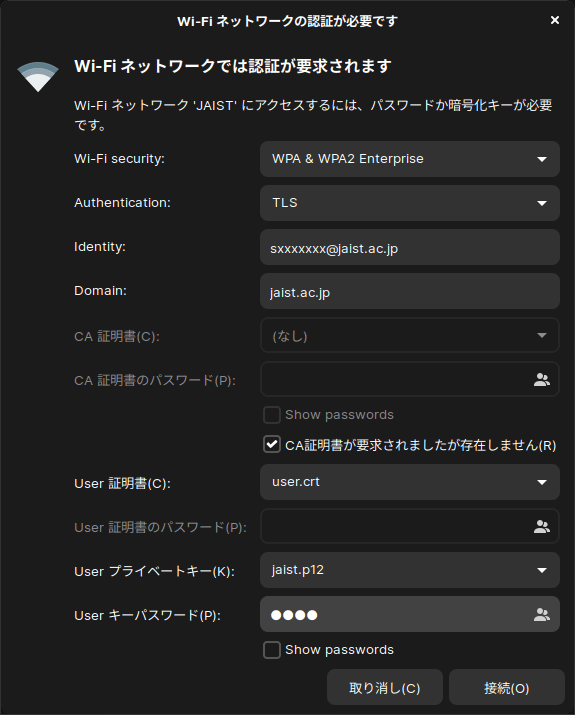

+++
image = "06ebab7d097dc0f8eca4aaf2c3fa0e34.png"
title = "Linux で JAIST の学内無線 LAN に接続する"
publishDate = "2020-01-18T08:52:00+09:00"
lastmod = "2020-01-18T08:52:00+09:00"
tags = [ "Tips", "JAIST", "Linux" ]
googleAds = true
aliases = ["52ce158c36a7b68357c0240ed889d682"]
+++

## 1. はじめに

　[JAIST](https://www.jaist.ac.jp/index.html) に在籍する人は，無料で無線 LAN を利用することができます。無線 LAN に接続するには[マニュアル](https://www.jaist.ac.jp/iscenter/network/wireless/)に従って設定を行う必要があります。しかし，現状のマニュアルには Linux に関するマニュアルが存在しません。また，暗号化方式として WPA2 エンタープライズを採用しているため設定手順が複雑です。本記事では，東京大学理学系研究科が公開している[マニュアル](http://jimubu.adm.s.u-tokyo.ac.jp/public/index.php/Linux_%E3%81%AE%E7%84%A1%E7%B7%9A%E8%A8%AD%E5%AE%9A%E4%BE%8B)を参考に，Linux で JAIST の学内無線 LAN に接続する手順について記述します。

## 2. 証明書準備

　まず初めに，[マニュアル](https://www.jaist.ac.jp/iscenter/digital-certificate/client-cert/)に従い [J-UPKI システム](https://pki.jaist.ac.jp/jupki/)を経由して電子証明書を発行し，任意の場所と名前 (本記事では，*jaist.p12*) で保存します。次に，*OpenSSL* コマンドを用いて *ユーザ証明書* を取得します。ユーザ証明書を取得する際にパスワードを要求されるので電子証明書を発行する際に設定したパスワードを入力します。

```bash
$ ls
jaist.p12
$ openssl pkcs12 -in jaist.p12 -clcerts -nokeys -out user.crt # ユーザ証明書
$ ls
jaist.p12  user.crt
```

## 3. 無線設定

　「設定」→「Wi-Fi」と進み，SSID *JAIST* または *eduroam* をクリックします。表示された Wi-Fi ネットワーク認証画面の項目に以下の内容を入力し，「接続」をクリックします。正常に通信ができれば設定完了です。

* Wi-Fi security: WPA & WPA2 Enterprise
* Authentication: TLS
* Identity: [JAIST アカウント]@jaist.ac.jp
* Domain: jaist.ac.jp
* CA 認証書: 空
* CA 認証書のパスワード: 空
* CA 証明書が要求されましたが存在しません: ☑
* User 証明書: user.crt
* User 証明書のパスワード: 空
* User プライベートキー: jaist.p12
* User キーパスワード: 電子証明書の発行時に設定したパスワード



## 4. おわりに

　ここまで，Linux で JAIST の学内無線 LAN に接続する手順について記述してきました。Linux や PKI に関する知識を持っている人は問題なくネットワーク認証設定ができると思います。しかし，JAIST は他分野出身でコンピューターサイエンスに関する知識が少ない人も多く在籍しています。本記事が，そういった方々の一助になれば幸いです。

## 環境情報

* OpenSSL Ver.1.1.1
* Bash Ver.4.4.20
* Zorin OS 15 Core (Ubuntu 18.04 LTS)