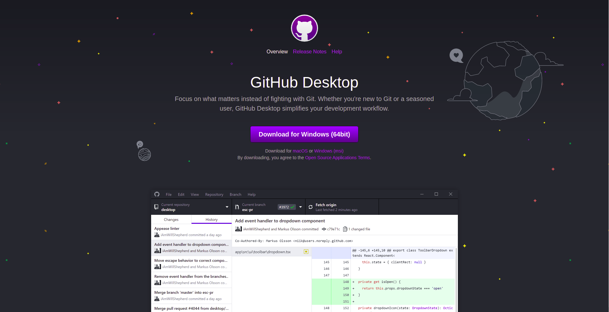
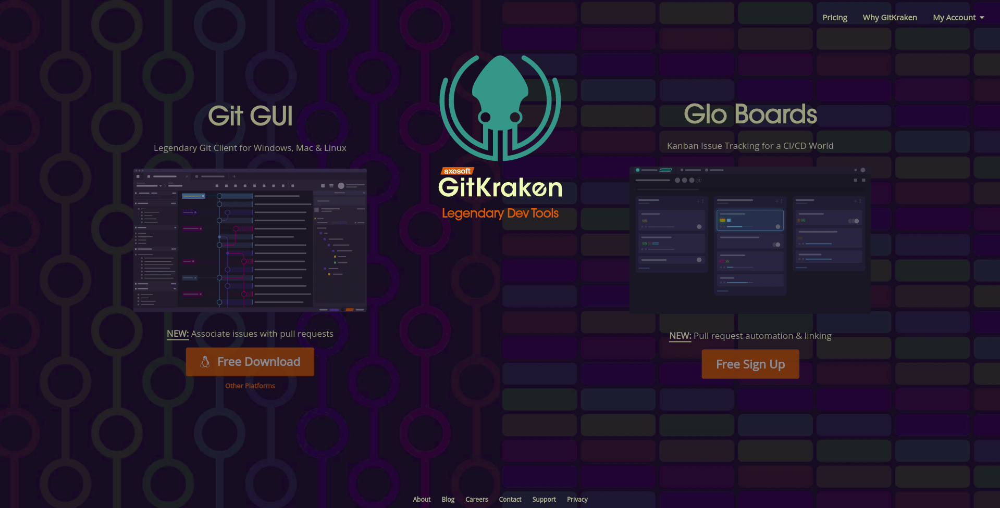
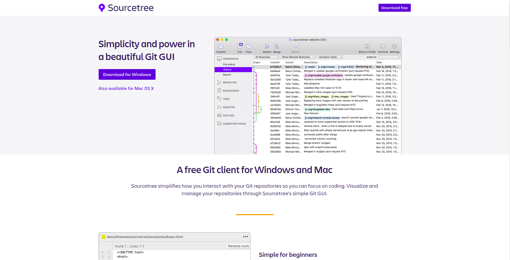

+++
slug = "c801f9f5894052fbd1531f2fafd4cebc"
image = ""
title = "オススメの Git クライアント 3 選"
publishDate = "2019-10-28T17:21:00+09:00"
lastmod = "2019-10-28T17:21:00+09:00"
tags = ["Git"]
googleAds = true
+++

## 1. はじめに

　Git クライアントは，Git で使用できる機能を制限する代わりに，より直感的な操作を出来るようにしたソフトウェアです。Git の初心者だけではなく，中級者・上級者の人も作業の効率化や操作ミスを減らすために使用することがあります。本記事では，オススメの Git クライアントを 3 つ紹介します。

## 2. GitHub Desktop

　[GitHub Desktop](https://desktop.github.com/) は，GitHub 社が Electron をベースに開発・保守している Git クライアントです。最低限の機能のみが実装されており，初心者が入門で使用するのにオススメです。また，GitHub との強力な連携機能が実装されており，GitHub をメインホスティングサービスとして利用しているユーザーにもオススメです。執筆時点で対応している OS は Windows と macOS のみです[^1]。

[^1]: Electron ベースのソフトウェアなので Linux に対応する可能性あり

## 3. GitKraken

　[GitKraken](https://www.gitkraken.com/) は，Axosoft 社が Electron をベースに開発・保守している Git クライアントです。よく使われるコマンドをバランス良く実装しており，ヘビーユーザーでも満足できる仕様になっています。また， 本記事で紹介している Git クライアントの中で唯一，Windows・macOS・Linux に対応しています 。しかし，執筆時点では日本語にローカライズされていないため英語が苦手な人は注意が必要です。

## 4. Sourcetree

　[Sourcetree](https://www.sourcetreeapp.com/) は，Atlassian 社が開発・保守している Git クライアントです。非常に多機能な重量級の Git クライアントです。また，本記事で紹介している Git クライアントの中で唯一 SVN[^2] に対応しています 。しかし，多機能が故に初心者が Git を覚える用途には向きません。

[^2]: SubVersioN の略称

## 5. おわりに

　ここまで，3 つの Git クライアントを紹介してきました。筆者は GitKraken をメインに使用しており，特殊な操作のみを Git コマンドで行っています。勿論，Git クライアント，Git コマンドの片方しか使用しないユーザーなど様々です。大事なのは，ツールに囚われることなく自分に合ったスタイルを見つけ出すことです。